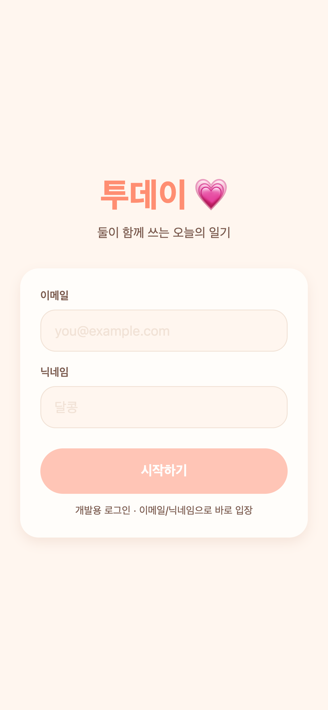
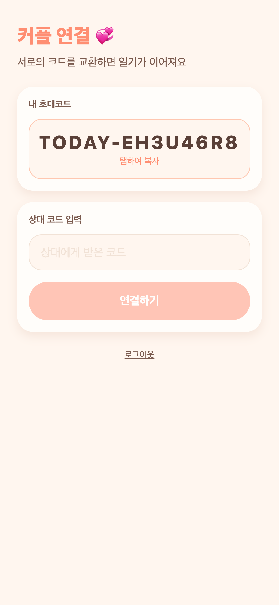
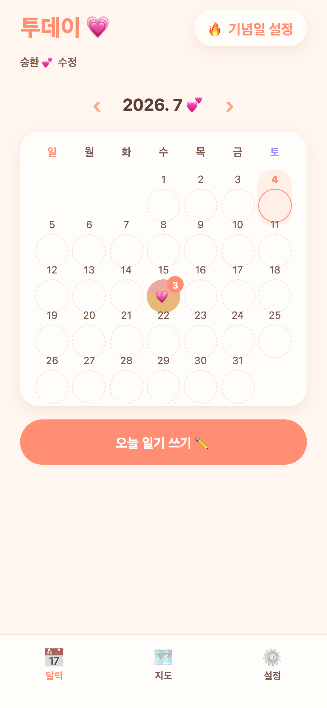
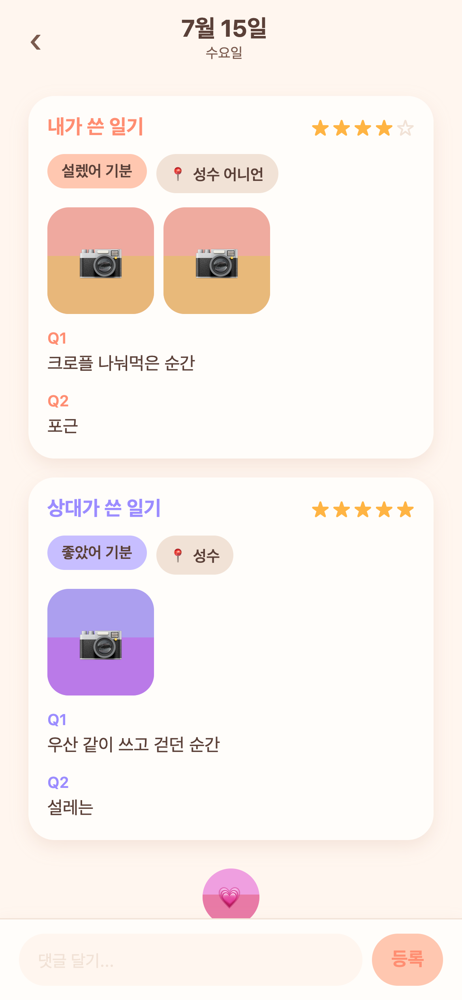
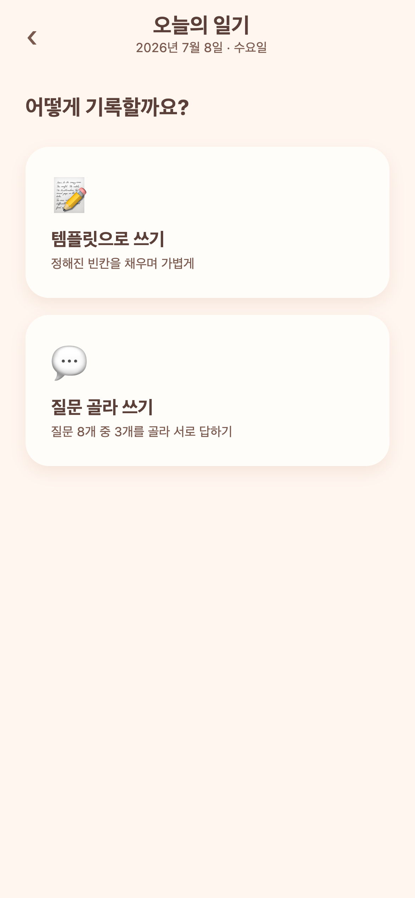
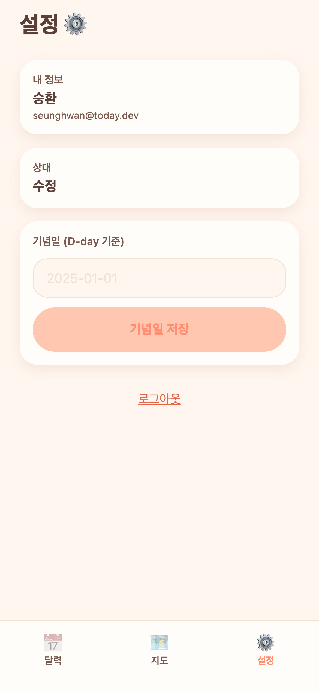

# 투데이 · 1차 구현 결과 & 실제 캡처

> 목업이 아니라 **실제로 빌드해 돌아가는 앱**을 라이브 백엔드에 붙여 캡처한 화면들.
> 스택: **Expo(RN·TS·expo-router) + Spring Boot(Java·JPA·MySQL·JWT)** 모노레포. 색: 워밍 코럴 계열.

## 구현 범위 (1차: 기반 골격 + 핵심 루프)
개발용 로그인 → 커플 연결(초대코드) → 사진 캘린더 → 일기 작성(템플릿/자유 질문픽) → **상호 공개(둘 다 써야 열림)** → 댓글 → 기념일/설정.

## 실행
- 백엔드: `cd backend && ./mvnw spring-boot:run` (MySQL `today`@3307, **포트 8083**)
- 프론트: `cd frontend && npx expo start --tunnel`
- 캡처 재현: Expo Web 정적빌드(`expo export -p web`) → Playwright/Chrome(`--disable-web-security` + 토큰 주입). 자세한 방법은 gymtracker `docs/screenshots/CAPTURE_METHODS.md` 참고.

---

## 실제 화면 캡처

### 1. 로그인 (개발용)
이메일·닉네임으로 바로 입장(카카오는 후속). "둘이 함께 쓰는 오늘의 일기".

### 2. 커플 연결
내 초대코드(백엔드가 발급한 실제 `TODAY-XXXX`) 공유 + 상대 코드 입력 → 커플 생성.

### 3. 홈 · 사진 캘린더
헤더에 커플·D-day, 월간 그리드. 일기 있는 날은 사진 썸네일(+장수 뱃지), 없는 날 점선 원, 오늘은 코럴 링. 하단 탭(달력·지도·설정).

### 4. 일기 상세 · 상호 공개 (OPEN)
둘 다 쓴 날 — **내 일기(★★★★☆·설렜어·성수 어니언)와 상대 일기(★★★★★·좋았어·성수)가 나란히**. 자유 질문픽 모드라 Q1/Q2 질문별로 두 답이 대응. 하단 댓글 입력. (한 명만 쓰면 LOCKED로 블러 처리됨)

### 5. 일기 작성 · 모드 선택
**템플릿으로 쓰기**(빈칸 채우기) vs **질문 골라 쓰기**(기본 질문 8개 중 3개 선택, 상대는 그 범위에서 답).

### 6. 설정
내 정보·상대·기념일(D-day 기준일) 설정·로그아웃.

---

## 백엔드 API (구현 완료)
`POST /api/auth/dev-login` · `GET/PATCH /api/me` · `POST /api/couple/invite|connect` · `GET /api/couple` · `PUT /api/couple/anniversary` · `GET /api/questions` · `GET /api/entries?year=&month=` · `GET/POST /api/entries/{date}` · `GET/POST /api/entries/{date}/comments`

핵심 규칙: 먼저 쓴 사람이 질문세트 확정 / status EMPTY·LOCKED·OPEN / OPEN 아니면 상대 글 잠금·댓글 차단 / 작성 3시간 뒤 수정 가능.

## 검증
- 백엔드: 컴파일·부팅·핵심 루프 E2E 통과(상호공개 LOCKED→OPEN, 댓글 잠금, 수정 제한)
- 프론트: `tsc --noEmit` 0, **프론트↔백엔드 계약 정합 후 위 캡처처럼 라이브 백엔드에서 실제 렌더 확인**

## 미구현(후속)
앨범/지도/회고("1년 전 오늘")/기념일 목록/월말 결산/알림 화면, 실제 사진 업로드(현재 색시드), 카카오 로그인, 디자인 토큰 미세정렬(목업 코럴톤에 더 맞추기).
