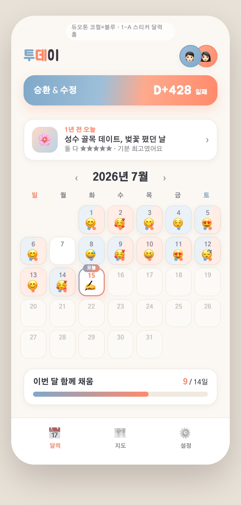
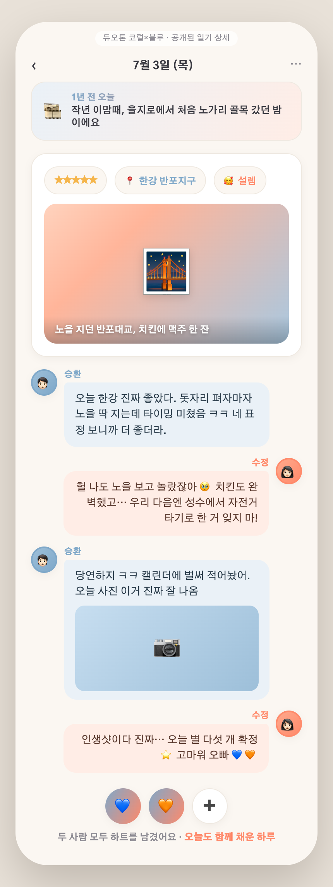
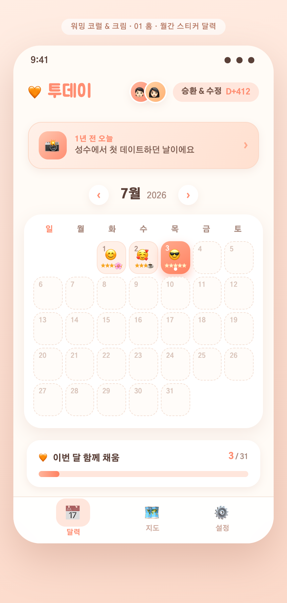
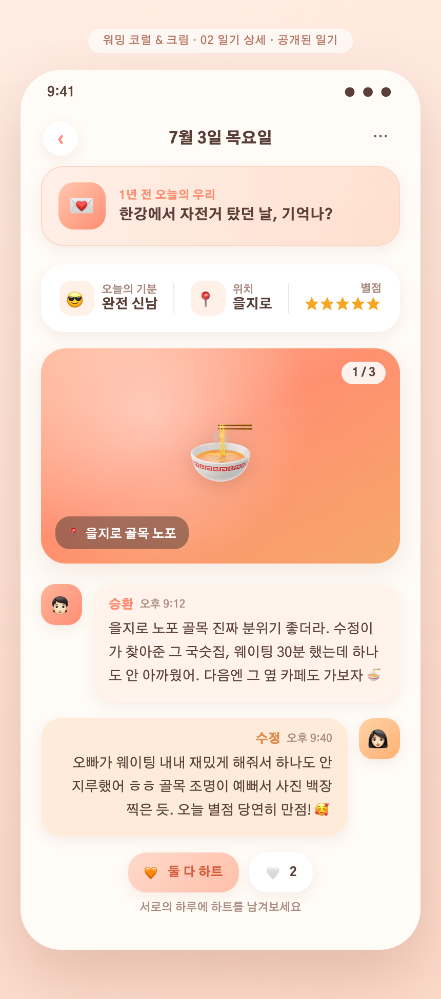

# 01 · 커플앱 느낌 색 리워크

## 배경
직전 리스타일 4색(크림·세이지·라벤더·모노)은 깔끔했지만 **"라이프스타일/미니멀 앱 같지, 커플앱 같지 않다"**는 피드백. 원인은 색의 온기 부족. → **따뜻하고 로맨틱하되 유치하지 않은** 커플앱 팔레트로 다시 잡음.

## 이번에 바뀐 것
- 🎨 무채색/차가운 톤 → **따뜻한 코럴 계열** 온기
- 👫 홈 헤더에 **승환·수정 두 프로필 아바타 나란히** (프로필 사진 기능과 연동 → [features/01-profile-photo.md](features/01-profile-photo.md))
- 🤝 "이번 달 **함께** 채움" 등 "우리 둘" 문구·시각화

선택된 방향 2가지를 목업으로 제작.

---

## A · 듀오톤 코럴×블루  ⭐ 추천
**두 사람을 색으로 페어링** — 승환=소프트 블루, 수정=웜 코럴. 두 색이 화면 곳곳에 함께 등장해 "우리 둘"이 가장 잘 드러남.
- D-day 배지: 블루→코럴 그라데이션 (둘이 한 배지에 섞임)
- 달력 칸: 둘 다 쓴 날은 블루/코럴 반반, 한 명만 쓴 날은 그 사람 색 → **함께 채우는** 느낌
- 상세: 승환(블루)/수정(코럴) 말풍선 교차, 하트도 💙🧡 함께

🔗 [홈 열기](https://htmlpreview.github.io/?https://github.com/seunghw2/couple-diary/blob/main/docs/planning/assets/01-couple-colors/mockups/duotone-coral-blue/01-home.html) · [상세 열기](https://htmlpreview.github.io/?https://github.com/seunghw2/couple-diary/blob/main/docs/planning/assets/01-couple-colors/mockups/duotone-coral-blue/02-detail.html)

---

## B · 워밍 코럴 & 크림
크림 베이스에 따뜻한 코럴·살구를 얹은 대표적 커플 온기. 채도를 눌러 유치하지 않게, 살구빛으로 "연애하는 느낌".
- 코럴을 오늘 셀·D-day·진행바·별점·하트에 온기 있게
- 두 아바타 헤더, 승환/수정 톤 차이로 말풍선 구분

🔗 [홈 열기](https://htmlpreview.github.io/?https://github.com/seunghw2/couple-diary/blob/main/docs/planning/assets/01-couple-colors/mockups/warm-coral-cream/01-home.html) · [상세 열기](https://htmlpreview.github.io/?https://github.com/seunghw2/couple-diary/blob/main/docs/planning/assets/01-couple-colors/mockups/warm-coral-cream/02-detail.html)

---

## 리드 추천
**A · 듀오톤 코럴×블루.** "커플앱 같지 않다"는 문제를 색 구조로 정면 해결 — 두 사람 색이 항상 함께 보여 "우리 둘" 정체성이 확실하다. 20대·성별 안 타고, 유치한 핑크도 아님.
더 부드럽고 무난한 온기를 원하면 **B · 워밍 코럴&크림**. (둘 다 헤더 두 아바타·"함께 채움" 유지)
