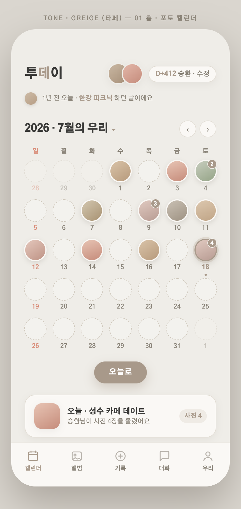
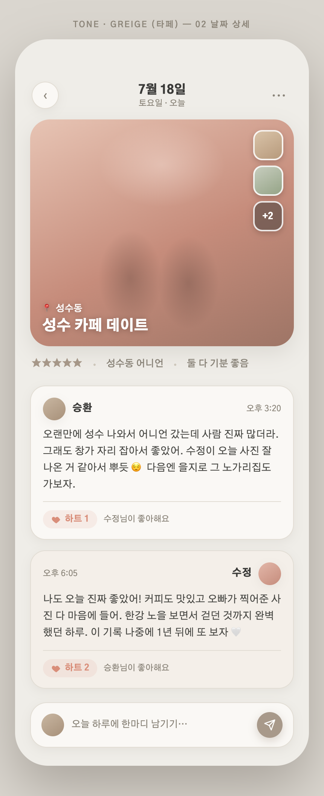
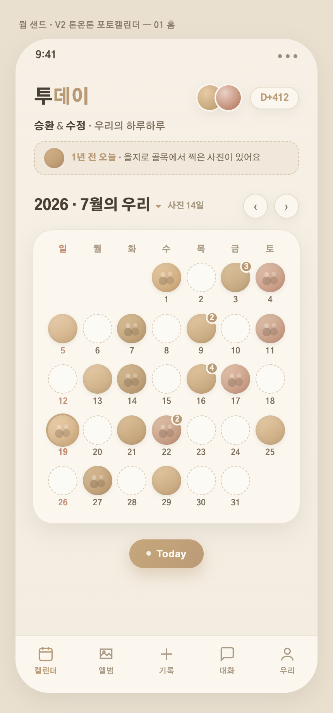
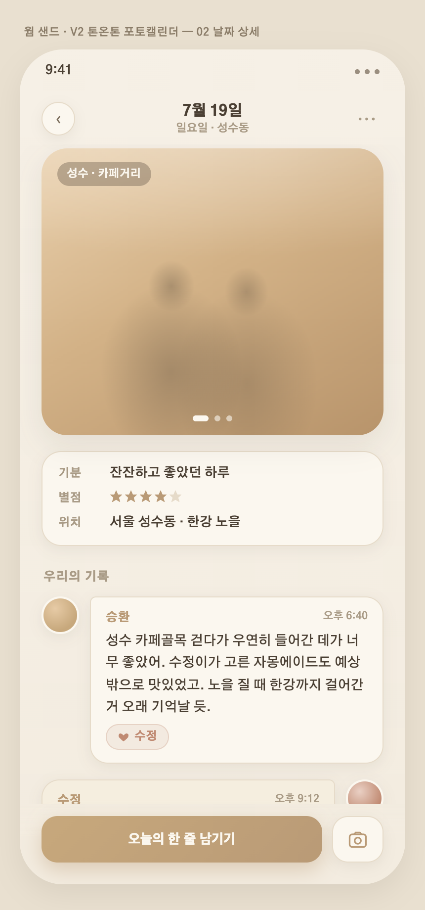
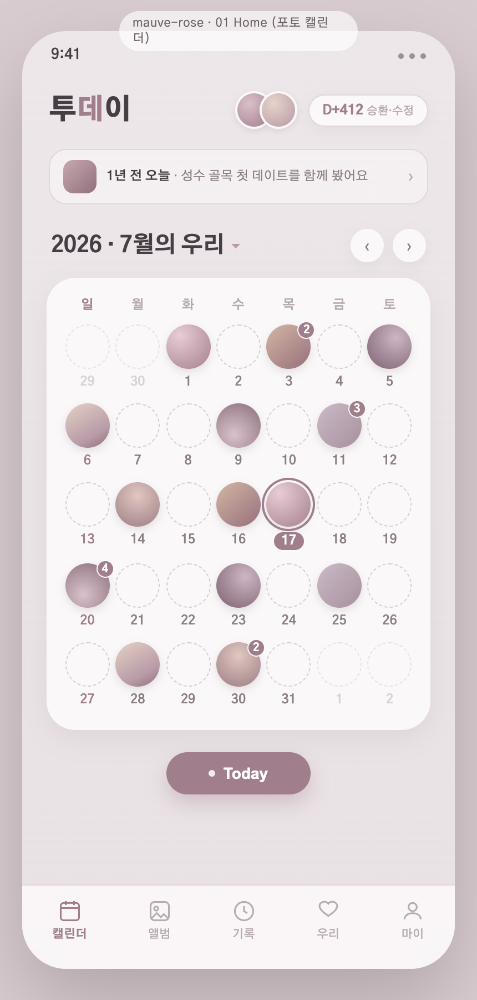
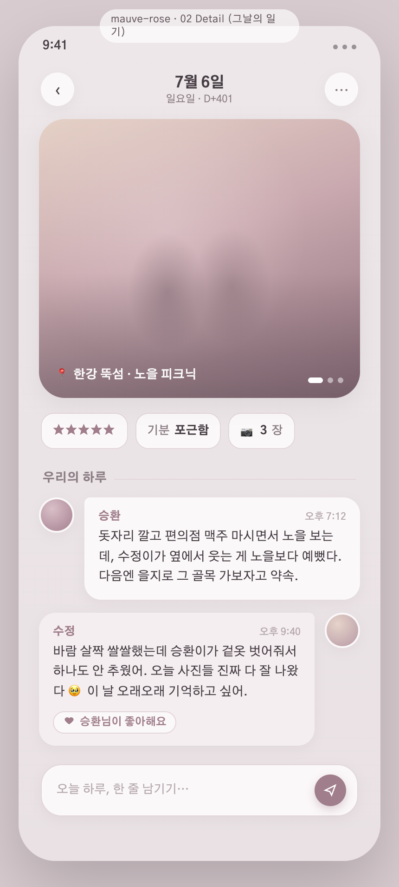

# 02 · 톤온톤 + 사진 캘린더 (썸원 참고)

## 배경
- 직전 **듀오톤(블루+코럴)**은 색이 번잡해서 반려 → **톤온톤**(한 색 계열의 명도 차이로만)으로 전환.
- 커플앱 **"썸원"의 캘린더("썸로그")** 참고: 아주 깔끔한 톤온톤 뉴트럴, **캘린더 칸이 이모지가 아니라 원형 사진 썸네일**.

## 이번에 바뀐 것
- 📷 **캘린더 = 원형 사진 썸네일** (그날 사진). 없는 날 = 옅은 점선 원, 여러 장이면 우상단 개수 뱃지. → **이모지 무드 아이콘 제거**
- 🎨 **톤온톤**: UI는 한 색 계열로만, 색감은 사진 썸네일이 담당 → 번잡함 없이 차분
- "2026 · 7월의 우리 ▾" 월 선택, "Today" 버튼, 깔끔한 5탭 바
- 헤더에 두 아바타 + D-day, "1년 전 오늘"은 아주 은은하게

색은 아직 고민이라 **톤온톤 3색**을 제시.

---

## A · 그레이지 / 타페  ⭐ 추천 (썸로그 톤)
웜 라이트 그레이 + 타페 단일 액센트. 참고 앱에 가장 가깝고, 사진이 제일 잘 산다. 담백·타임리스.

🔗 [홈 열기](https://htmlpreview.github.io/?https://github.com/seunghw2/couple-diary/blob/main/docs/planning/assets/02-tone-photo/mockups/greige/01-home.html) · [상세 열기](https://htmlpreview.github.io/?https://github.com/seunghw2/couple-diary/blob/main/docs/planning/assets/02-tone-photo/mockups/greige/02-detail.html)

---

## B · 웜 샌드 / 베이지
베이지·샌드·카멜 한 계열. 따뜻하고 아늑한 톤온톤. 그레이지보다 온기가 더 있음.

🔗 [홈 열기](https://htmlpreview.github.io/?https://github.com/seunghw2/couple-diary/blob/main/docs/planning/assets/02-tone-photo/mockups/warm-sand/01-home.html) · [상세 열기](https://htmlpreview.github.io/?https://github.com/seunghw2/couple-diary/blob/main/docs/planning/assets/02-tone-photo/mockups/warm-sand/02-detail.html)

---

## C · 뮤트 모브 / 더스티 로즈
채도 눌린 로즈·모브 한 계열. 톤온톤을 유지하면서 **은은한 커플 온기**를 더함(유치한 핑크 아님).

🔗 [홈 열기](https://htmlpreview.github.io/?https://github.com/seunghw2/couple-diary/blob/main/docs/planning/assets/02-tone-photo/mockups/mauve-rose/01-home.html) · [상세 열기](https://htmlpreview.github.io/?https://github.com/seunghw2/couple-diary/blob/main/docs/planning/assets/02-tone-photo/mockups/mauve-rose/02-detail.html)

---

## 리드 추천
**A · 그레이지**가 참고한 썸로그에 가장 가깝고, 톤온톤이라 사진(=진짜 색)이 가장 잘 산다. 담백하고 오래 봐도 안 질림.
커플 온기를 조금 더 원하면 **C · 모브로즈** — 톤온톤은 유지하면서 은은하게 로맨틱. **B · 웜 샌드**는 그 중간(아늑).
셋 다 캘린더 사진·개수 뱃지·Today·5탭 구조는 동일해서 색만 갈아끼우면 됨.
