# 03 · 투데이 A to Z 전체 화면 스토리보드

> 확정 스타일 **워밍 코럴 & 크림**(01 문서 B안)로 앱 전체 19화면을 목업.
> 구조는 **사진 캘린더**(02 문서, 썸로그식·이모지 없음) 유지. 커플: 승환 & 수정.
> 순서 = 실제 사용자 여정: **가입 → 연결 → 홈 → 잠금 → 작성 → 공개·댓글 → 앨범·지도 → 회고·기념일 → 마이·설정**

---

# 1장 · 온보딩 — 처음 만나는 투데이

## 1-1 스플래시 + 카카오 로그인
앱 첫 인상. **카카오로 시작하기**(메인) + Apple(보조). 카피 "둘 다 쓰면, 서로의 하루가 열려요"로 핵심 규칙을 첫 화면부터 각인.

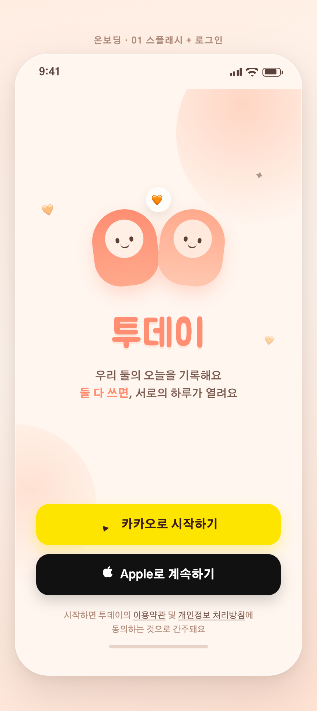

## 1-2 커플 연결
내 초대코드(TWODAY-3F7K)를 **카카오톡으로 공유**하거나, 상대 코드를 입력해 연결. 연결 전엔 "대기 중" 상태.

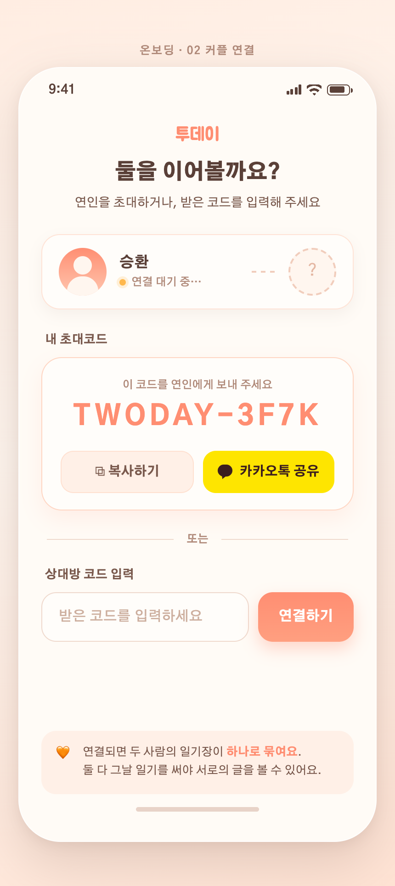

## 1-3 프로필 설정 (스텝 2/3)
원형 **프로필 사진 업로더**(카메라 뱃지) + 이름·애칭. → [기능 01 · 프로필 사진](features/01-profile-photo.md)

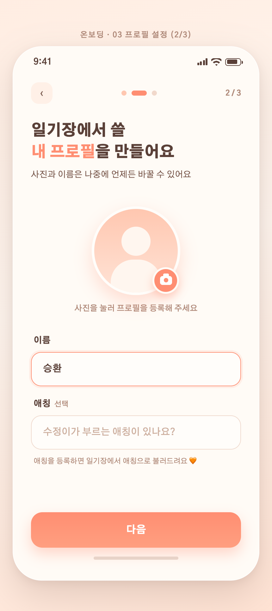

## 1-4 기념일 설정 (스텝 3/3)
"우리가 만난 날" 스피너 선택 → **"오늘로 D+412일이에요 🧡"** 즉시 미리보기. 생일은 선택 입력.

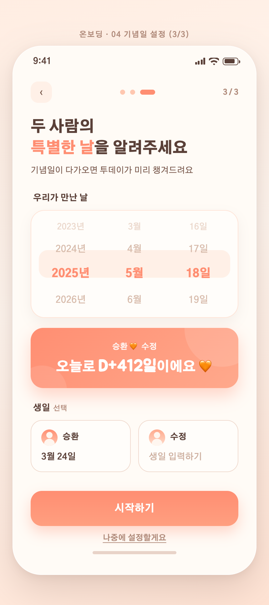

---

# 2장 · 홈 — 포토 캘린더

## 2-1 홈 (캘린더 탭)
헤더: 로고 + 승환·수정 아바타 + D+412. 은은한 "1년 전 오늘" 배너. **원형 사진 썸네일 캘린더**(빈 날 점선 원·개수 뱃지·오늘 코럴 링), Today 버튼, 오늘 요약 카드("수정님이 기다리고 있어요"), 5탭(캘린더·앨범·기록+·대화·마이).

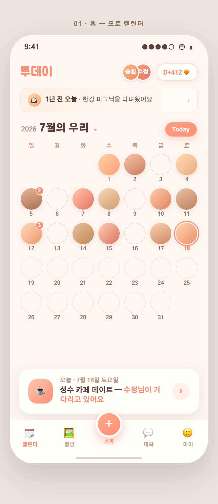

## 2-2 잠금 상태 — 상대만 쓴 날
수정의 일기가 **블러+🔒**. 실루엣만 살짝 비쳐 궁금하게. "내 일기를 쓰면 열려요" → **지금 쓰러 가기**. 상호 공개 규칙의 핵심 화면.

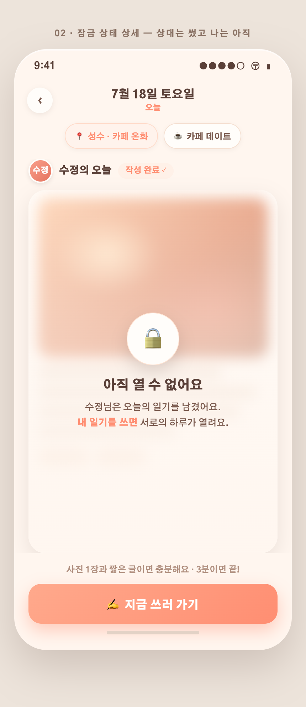

---

# 3장 · 작성 플로우

작성은 두 가지 모드 — **① 고정 템플릿**(빠르게)과 **② 자유(질문 픽)**(둘이 같은 질문에 문답).

## 3-1 일기 작성 — 고정 템플릿 모드
**템플릿 칩**(데일리/데이트/여행/자유) → 빈칸 채우기 폼("오늘 우리는 [성수 카페거리]에서…"). 별점·기분 칩·사진 첨부·위치 칩. 하단 "수정님이 아직 안 썼어요 · 저장하면 잠금 상태로 기다려요".

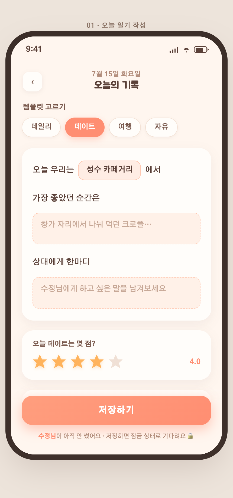

## 3-1B 자유(질문 픽) 모드 ⭐ 신규
템플릿 대신 **"자유"**를 고르면 둘이 같은 질문에 답하는 문답 일기. → 기능 상세 [features/03-질문 픽](features/03-question-pick.md)

**흐름:** 먼저 쓰는 사람(승환)이 기본 질문 8개 중 **3개를 고름** → 그 3개가 그날의 "오늘의 질문"으로 고정 → 나중에 쓰는 사람(수정)은 **그 3개 범위 안에서** 답하고 싶은 걸 골라(최소 1개) 답함 → 둘 다 쓰면 질문별로 두 답이 나란히 공개.

**① 승환 — 질문 3개 고르기** (기억에 남는 장면 / 한 줄 요약 / 상대가 귀여웠던 순간 선택, 3/3)

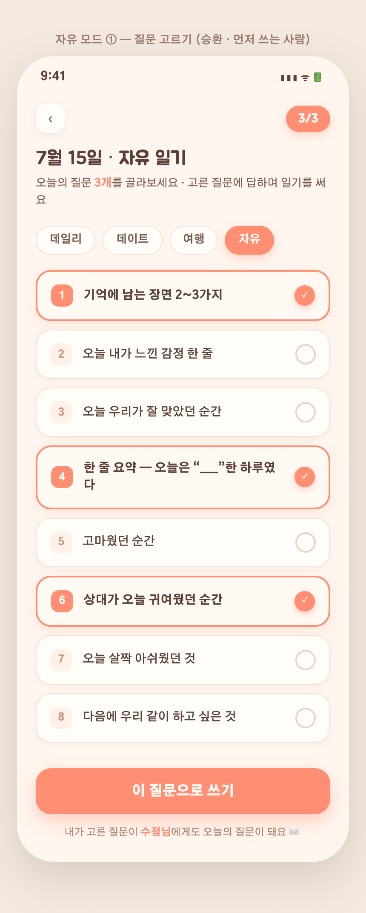

**② 승환 — 고른 Q1·Q2·Q3에 답 쓰기** (한 줄 요약은 "오늘은 「포근」한 하루였다" 빈칸형)

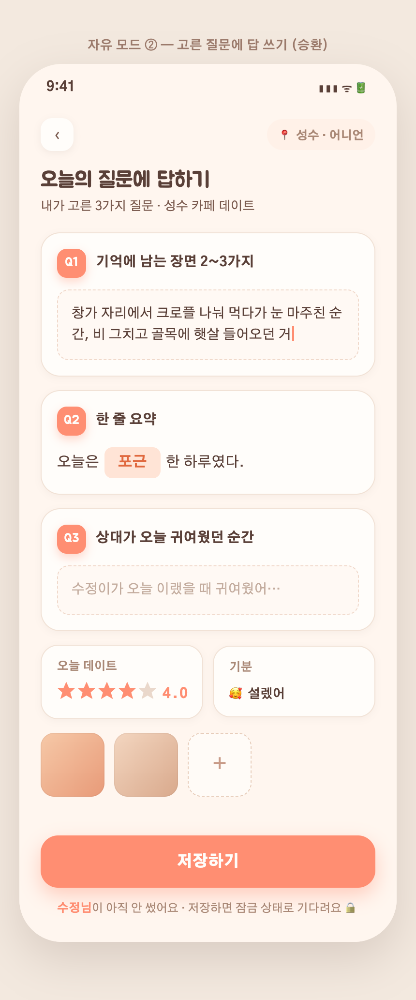

**③ 수정 — 승환이 고른 질문 범위에서 답하기** ("승환님이 오늘의 질문 3개를 골랐어요 💌", 승환 답은 🔒 블러, 골라서 답)

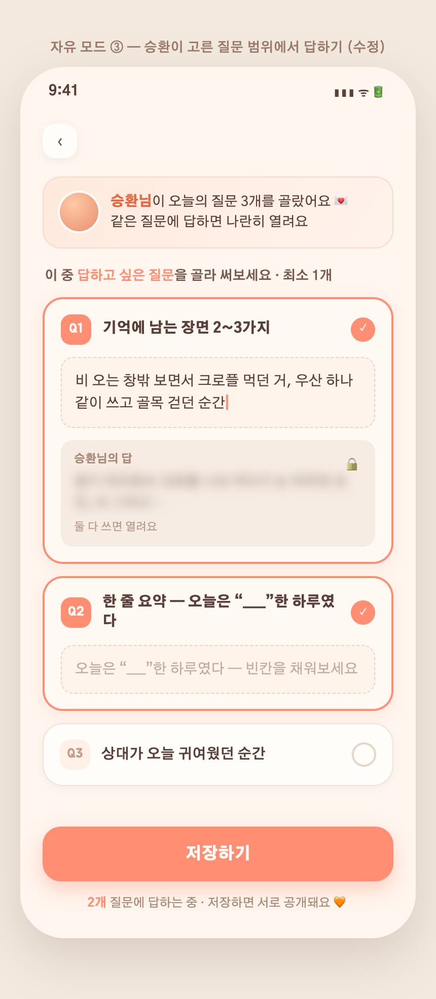

## 3-2 위치 추가
장소 검색 + 지도 핀 + 하단 검색 결과 시트(대림창고 성수 선택) + 최근 방문 칩. → 일기에 📍로 저장.

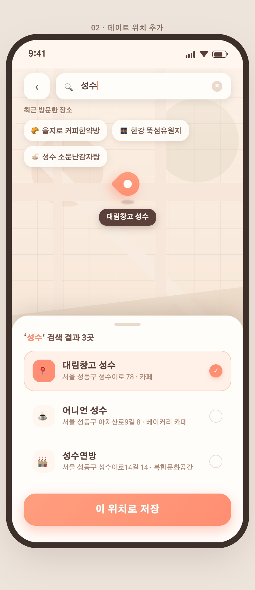

## 3-3 저장 완료 — 잠금 대기
내 일기 저장 ✓, 수정 대기 중. **"수정님 콕 찌르기 👉"**(카톡 알림). "작성한 일기는 3시간 뒤부터 수정할 수 있어요" — 수정 지연 규칙 안내.

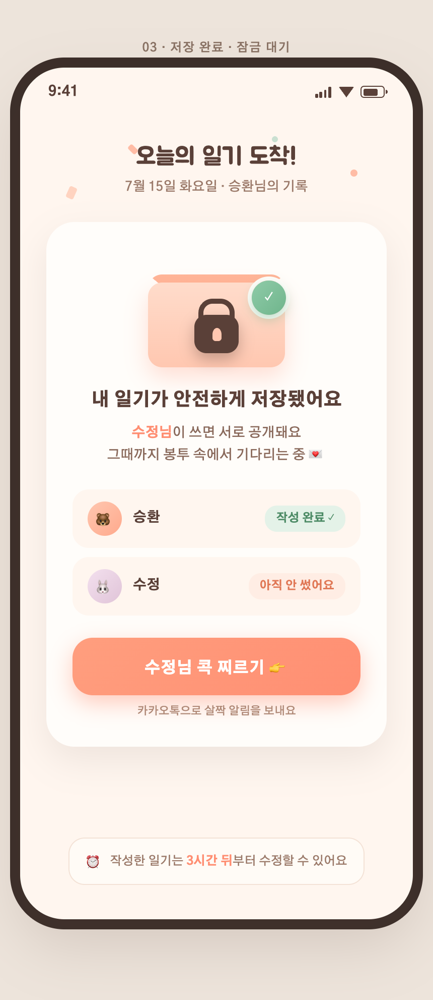

## 3-4 공개된 일기 + 댓글
둘 다 쓰면 공개: 큰 사진, 별점·위치·기분 칩, 승환/수정 말풍선 교차, 하트 반응, **댓글 대화**("다음엔 내가 살게 🧡" / "약속~") + 입력 바. → [기능 02 · 댓글](features/02-comments.md)

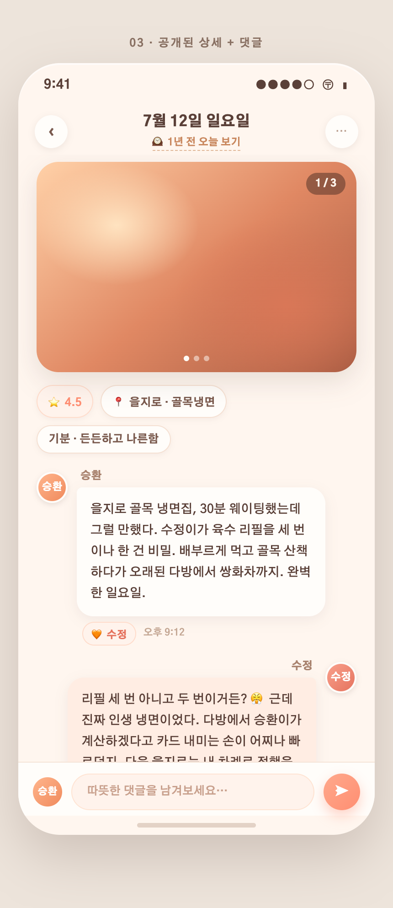

---

# 4장 · 앨범 & 지도 — 쌓인 추억

## 4-1 앨범 탭
일기 사진이 자동으로 모임 — 월별 3열 그리드(128장), 위치·즐겨찾기·영상 뱃지, 필터 칩.

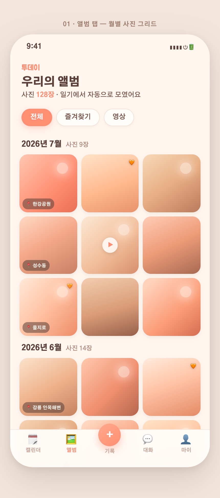

## 4-2 지도 뷰
"앨범 | 지도" 세그먼트. 지도 위 **코럴 하트 핀**(성수 5·을지로 3·한강 7…), "우리가 함께 간 곳 23곳" 시트. 데이트 위치 저장의 보상 화면.

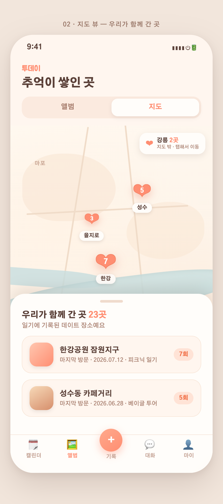

## 4-3 사진 뷰어
풀스크린 사진 + 날짜·위치 칩 + **"이 날의 일기 보기 →"** (사진에서 일기로 역이동).

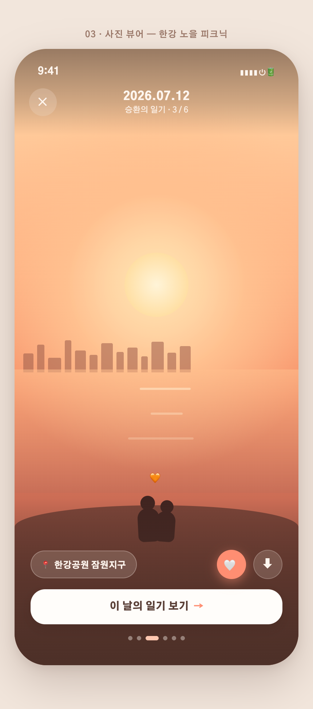

---

# 5장 · 회고 & 기념일 — 타임캡슐

## 5-1 "1년 전 오늘"
편지 봉투가 열리는 회고 카드 — 그날의 사진·둘의 일기 발췌·별점·위치. "수정님에게 이 추억 보내기 🧡".

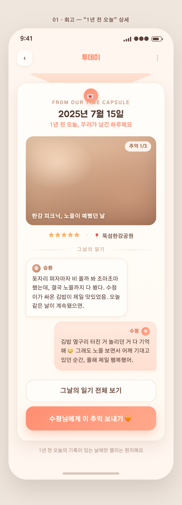

## 5-2 기념일 관리
대형 D+412 카드(500일까지 진행바), 다가오는 기념일 리스트 + 알림 토글, 100일 단위 자동 생성.

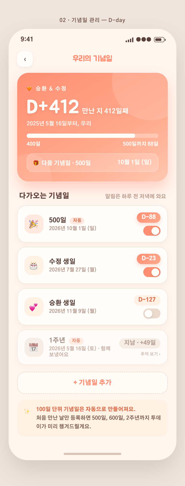

## 5-3 월말 결산 — "7월의 우리"
일기 24편·사진 47장·장소 6곳·평균 별점 4.2, **베스트 데이트**(둘 다 별 5개), 기분 분포, 카드 저장/공유. "7월의 우리, 참 자주 웃었어요."

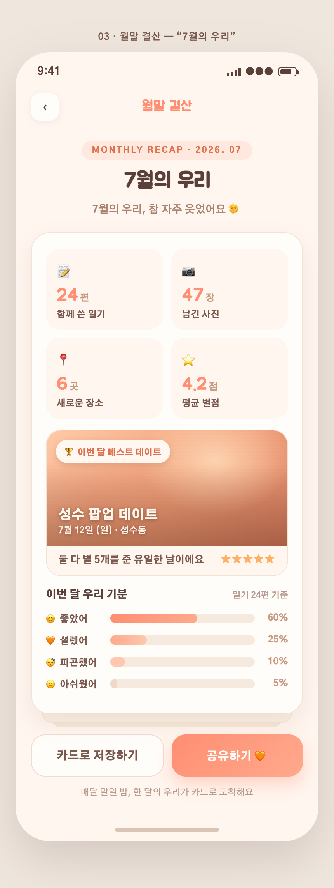

---

# 6장 · 마이 & 설정

## 6-1 마이(우리) 탭
커플 카드(아바타+D-day) + 기록 요약(일기 214·사진 128·장소 23) + 메뉴(프로필 편집/기념일/결산/알림/위젯/설정).

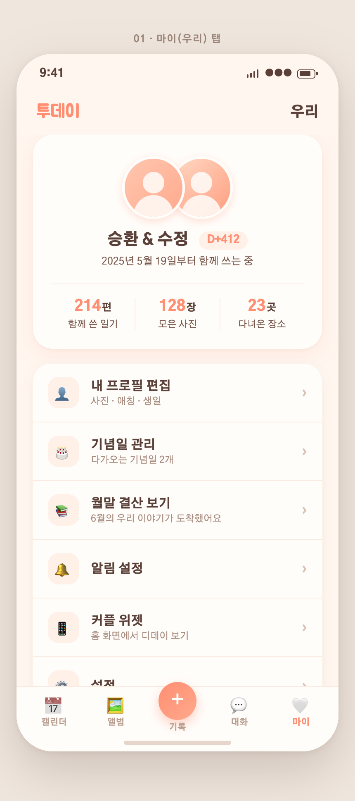

## 6-2 프로필 편집 — 사진 변경
큰 원형 사진 + 카메라 뱃지 → **하단 시트(카메라/앨범/기본 이미지)** 열린 상태. "사진을 바꾸면 수정님 화면에도 바로 반영돼요". → [기능 01](features/01-profile-photo.md)

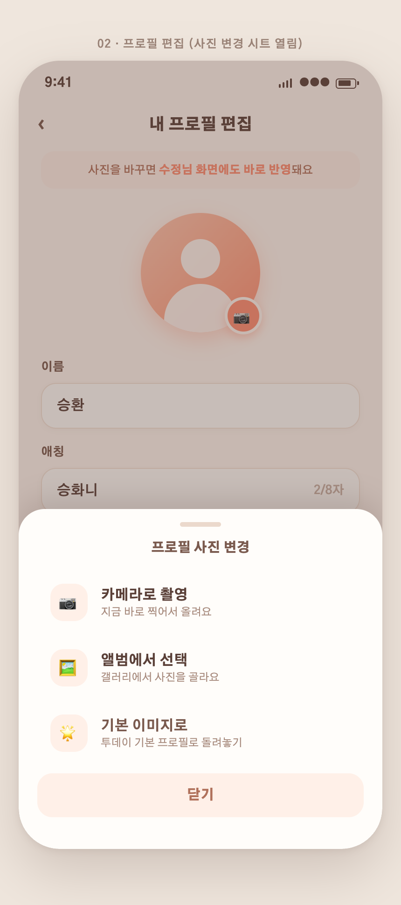

## 6-3 설정
[알림] 일기 리마인드 21:00·상대 작성·기념일 / [일기] 수정 가능 시간(3시간)·템플릿 관리 / [계정] 카카오 연결·데이터 내보내기 / [커플] 연결 관리·해제(주의 문구).

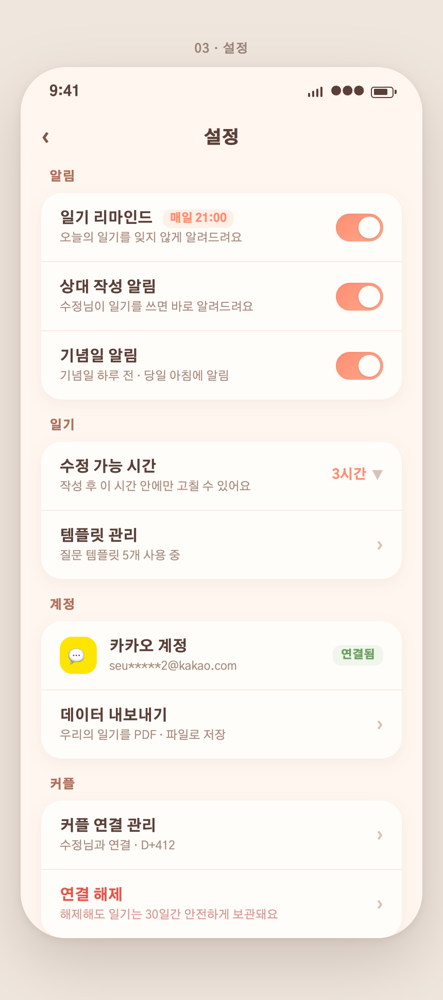

---

## 화면 인벤토리 & 다음 단계
- **총 22화면**: 온보딩 4 · 홈/캘린더 3 · 작성 3 + **자유 질문픽 3** · 앨범/지도 3 · 회고/기념일 3 · 마이/설정 3
- 모든 HTML 원본: `assets/03-full-app/mockups/<그룹>/` (브라우저로 열면 실제 화면)
- **다음**: 이 스토리보드 확정 → 데이터 모델·API 설계 → Expo 앱 구현 시작 (카카오 로그인 → 커플 연결 → 홈 → 작성 순서 권장)
