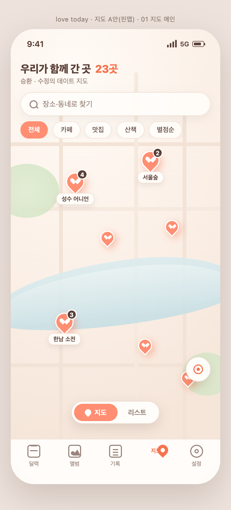
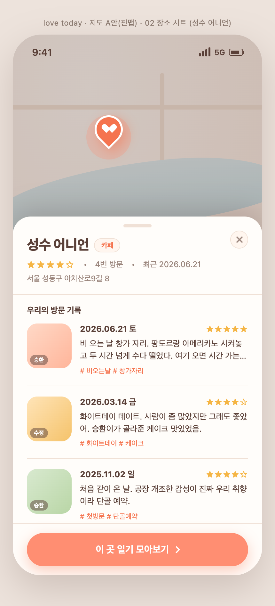
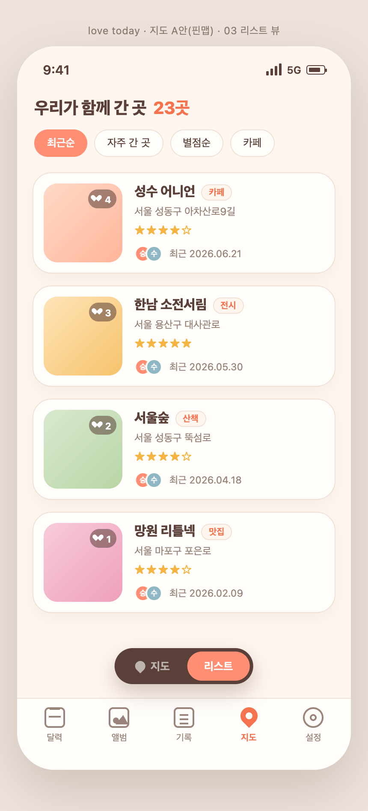
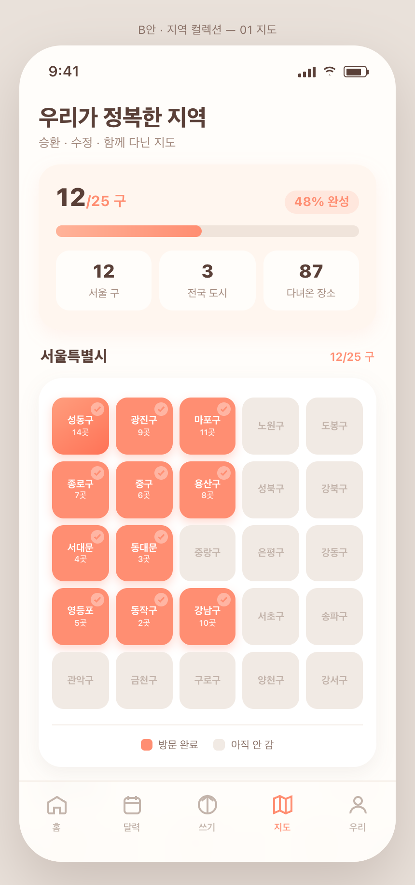
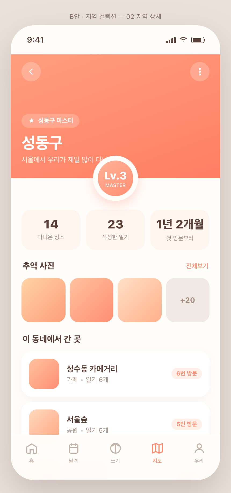
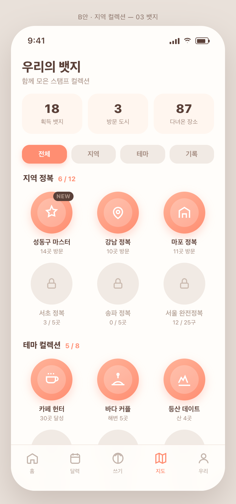
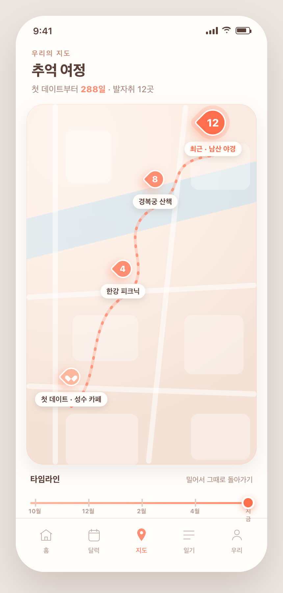
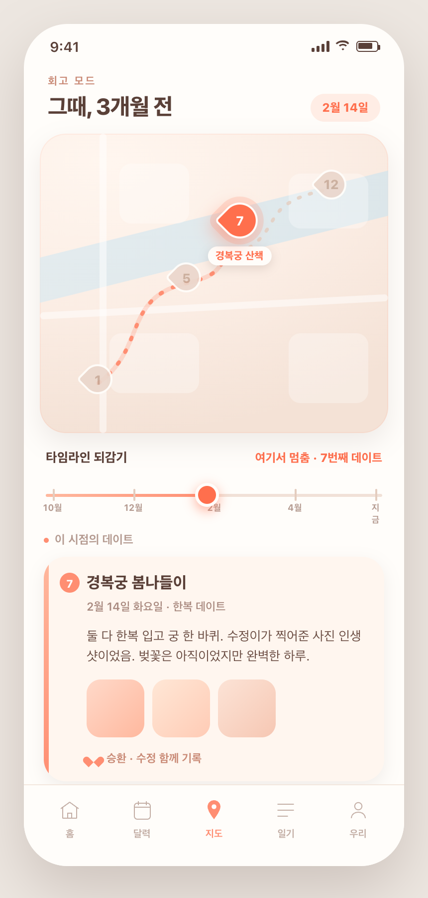
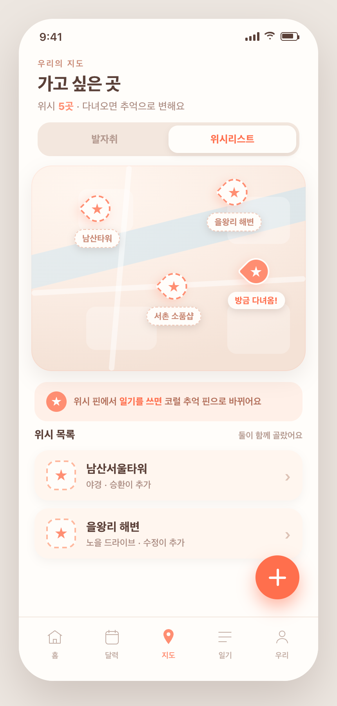

# 10 · 지도 기능 — 3버전 목업

**API 확정: Kakao Map (WebView JS API)** — Expo Go에서 그대로 동작, 무료 쿼터 넉넉, 커스텀 핀 쉬움. (Naver 네이티브 SDK는 dev 빌드 필요라 제외)
데이터: 이미 일기마다 **다중 장소**가 저장됨 → 이걸 지도에 뿌린다. 색=워밍 코럴&크림.

3가지 방향을 목업으로 만들었어. 하나 골라주면 그 방향으로 구현할게.

---

## A · 우리가 간 곳 핀맵  ⭐ 추천
지도에 데이트 장소마다 코럴 하트 핀. "우리가 함께 간 곳 N곳", 핀 탭 → 그 장소의 일기들. 가장 직관적이고, 지금 있는 장소 데이터를 바로 씀. Kakao 핀으로 구현 쉬움.

---

## B · 지역 컬렉션 / 정복
방문한 지역(서울 구·전국 도시)을 색칠·스탬프로 수집. "서울 12/25구", 지역 뱃지, 커버리지 성취감. 게임형. (단 지역 경계 데이터 필요 → 구현 난도 ↑)

---

## C · 추억 여정 + 위시리스트
데이트 장소를 시간순으로 잇는 여정 라인(첫 데이트 → 최근). 타임라인을 밀면 그때까지 경로가 그려짐(감성). + "가고 싶은 곳" 위시 핀. 감성·회고 강점.

---

## 리드 추천
**A · 핀맵**을 코어로. 지금 있는 장소 데이터를 그대로 쓰고, "우리가 간 곳"이라는 지도 탭의 본질에 가장 맞아. Kakao 커스텀 핀으로 구현도 제일 깔끔. 
C(추억 여정)의 시간순 라인은 나중에 A 지도의 보조 뷰(타임라인 토글)로 얹으면 좋아. B(지역 정복)는 재밌지만 구·동 경계 데이터가 필요해 난도가 높아 후순위.
