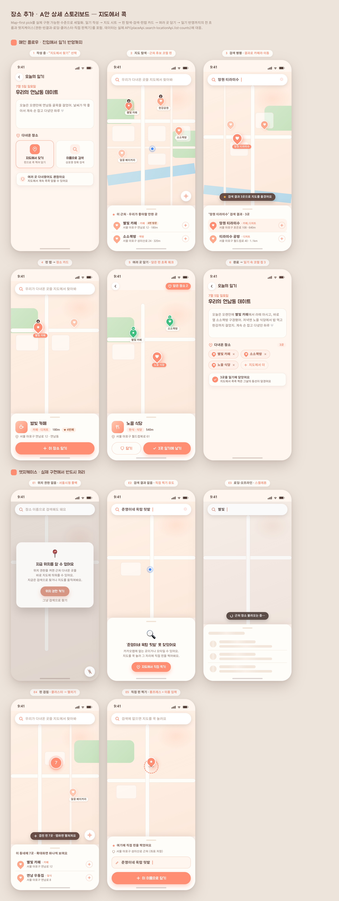

# 15a · 장소 추가 A안 상세 — 지도에서 콕 (Map-first pick)

> **날짜**: 2026-07-05
> **배경**: [15-place-add.md](15-place-add.md)에서 3안(A/B/C) 개괄 비교만 있었다. 이 문서는 그중 **A안 — 지도에서 콕**을 실제 구현 가능한 수준으로 세밀화한 상세 스토리보드다.
> 지도 자산([10-map.md](10-map.md), Kakao Map WebView)을 그대로 얹는 흐름이라 팔레트·핀·폰트를 100% 계승한다.



> 위 이미지가 안 뜨면: `assets/15-place-add/mockups/a-mappick-detail/shot.png` · 원본 HTML은 같은 폴더의 `index.html`.

---

## 한 줄 요약

일기 작성 중 "다녀온 장소 → 지도에서 찾기"를 누르면 **지도 시트**가 열린다. 현재 위치 중심에 최근·단골 코럴 핀이 흩뿌려지고(방문 2회+는 뱃지), 핀을 탭하면 하단에 장소 카드가 뜬다. **여러 곳을 이어서 담을 수 있고**(담은 핀은 초록 체크), 다 담으면 일기의 "다녀온 장소"에 코럴 칩으로 반영된다. 검색·직접 핀찍기·권한없음 등 엣지케이스까지 포함.

---

## 메인 플로우 (6프레임)

### 1 · 진입 — 작성 화면에서 "지도에서 찾기"
- 일기 작성 화면 "다녀온 장소" 섹션에 **두 개의 선택 카드**: `지도에서 찾기`(코럴 강조, 기본) · `이름으로 검색`(기존 텍스트 검색).
- 지도 카드를 탭하면 **전체 높이 지도 시트**가 아래에서 올라온다(`Modal animationType="slide"`, 기존 KakaoPlaceSearch와 동일 패턴).
- 안내 문구: "여러 곳 다녀왔어도 괜찮아요 — 지도에서 계속 콕콕 담을 수 있어요".

### 2 · 지도 탐색(기본 상태)
- **현재 위치(파란 점)** 중심으로 지도가 열린다. 권한 있으면 `expo-location`으로 좌표 획득.
- 주변에 **후보 핀**(코럴 3단계 명암): `--primary`=단골·최근, `--coralSoft`=근처 후보, `--coralSofter`=먼 후보.
- **방문횟수 뱃지**: `counts[name] >= 2`이면 핀 우상단에 숫자 뱃지(별빛 카페 4, 한강공원 2). — 이미 KakaoMap이 쓰는 `counts` 로직 재사용.
- 하단 **미니 시트** "이 근처 · 우리가 좋아할 만한 곳": 상호명·카테고리·거리·방문뱃지 + 우측 `+` 담기 버튼(핀 탭 없이 리스트에서 바로 담기 가능).
- 우하단 **내 위치 버튼**.

### 3 · 검색 병행
- 상단 **검색바**에 입력 → 350ms 디바운스로 `placeApi.search(q)` 호출(기존 로직 그대로).
- 결과가 오면 **지도 위 핀 갱신 + 카메라를 결과 bounds로 이동**(`map.setBounds`). 첫 결과는 `active`로 강조.
- 이동 직후 지도 상단에 토스트 핀트: "검색 결과 N곳으로 지도를 옮겼어요".
- 하단 시트는 검색 결과 리스트로 전환, 첫 항목 하이라이트.
- 검색바 `x` 버튼으로 지우면 2번(탐색 기본)으로 복귀.

### 4 · 핀 탭 → 장소 카드
- 핀을 탭하면(`postMessage({type:'select', name})`) 해당 핀이 `active`(확대·코럴)로, 하단 시트가 **장소 카드**로 바뀐다.
- 카드 내용: 카테고리 아이콘 썸네일 · 상호명(Jua) · 카테고리 태그 · **거리** · **방문 뱃지("4번째")** · 주소.
- 하단 큰 버튼 **"이 장소 담기"**. 이미 담은 핀이면 버튼이 초록 "담김 ✓"으로 바뀌고 다시 누르면 담기 해제.

### 5 · 여러 곳 담기
- 담은 핀은 **초록 + 체크 뱃지**로 구분(별빛 카페·소소책방 담김, 노을 식당 탐색 중).
- 상단 우측 **"담은 장소 N" 바스켓 칩**(코럴, 실시간 카운트). 탭하면 담은 목록 시트.
- 장소 카드 하단은 두 버튼: `담기`(현재 활성 핀) · **"N곳 일기에 넣기"**(전체 확정, 코럴).
- 하루 여러 곳(카페→책방→식당) 이어 담기 지원.

### 6 · 추가 완료 → 일기 반영
- 확정하면 시트가 닫히고 작성 화면 "다녀온 장소"에 **코럴 칩 N개**로 담긴다. 각 칩엔 `x`(개별 삭제) + "지도에서 더" 점선 칩.
- 상단 라벨 옆 카운트 뱃지("3곳"), 하단 완료 토스트: "3곳을 일기에 담았어요 — 지도에서 콕콕 찍은 그날의 동선이 담겼어요".

---

## 엣지케이스 (5프레임) — 구현의 핵심

### E1 · 위치 권한 없음/거부
- 권한 거부 시 **서울시청 폴백 중심**(KakaoMap의 기존 폴백 좌표 `37.5665,126.9780`)으로 지도를 흐리게 표시.
- 중앙 카드: "지금 위치를 알 수 없어요" + `위치 권한 켜기`(`Linking.openSettings()`) / `그냥 검색으로 찾기`.
- 검색바 placeholder를 "장소 이름으로 검색해도 돼요"로 바꿔 대체 경로 제시. 내 위치 버튼은 빗금 처리(비활성).

### E2 · 검색 결과 없음
- `placeApi.search` 결과 0건이면 시트에 빈 상태: "‘{검색어}’ 못 찾았어요" + "카카오맵에 없는 곳이거나 오타일 수 있어요".
- **직접 찍기로 유도**: `지도에서 직접 찍기` 버튼 → E5 흐름(롱프레스)으로 연결.

### E3 · 로딩 / 오프라인
- 검색·근처 조회 중엔 하단 시트에 **스켈레톤**(핀 자리 원 + 2줄 바, shimmer), 지도 상단에 "근처 장소 불러오는 중…" 스피너 핀트.
- 오프라인/타임아웃이면 동일 자리에 "네트워크가 불안정해요 · 다시 시도" (스켈레톤 대신 재시도 버튼)로 폴백.

### E4 · 핀 겹침(클러스터) / 후보 없음
- 줌 레벨이 낮아 핀이 겹치면 **클러스터 버블**(원 안 숫자, 코럴). 탭하면 확대되며 개별 핀으로 펼쳐짐.
- 시트엔 "이 동네에 N곳 · 확대하면 하나씩 보여요" + 리스트로 개별 담기 가능.
- 후보가 아예 없는 지역이면 미니 시트에 "이 근처엔 다녀온 곳이 아직 없어요 · 검색하거나 직접 찍어봐요".

### E5 · 직접 핀 찍기(검색에 없는 곳)
- 지도를 **롱프레스**하면 그 좌표에 코럴 핀이 떨어지고(리플), 시트에 좌표 역지오코딩 주소("성미산로 근처") + **이름 입력창**.
- 이름 입력 후 "이 이름으로 담기". 좌표를 함께 저장해 나중에 지도 탭에서도 핀으로 뜬다.
- KakaoMap이 지금은 좌표를 저장 안 하고 이름만 저장(매번 지오코딩) → **직접 찍은 곳은 좌표 저장이 필수**(아래 데이터 항목 참고).

---

## 필요 기능·데이터·API (구현 관점)

### 이미 있는 것 (재사용)
| 자산 | 위치 | 이 안에서의 역할 |
|---|---|---|
| `placeApi.search(query)` → `{ name, address, category? }[]` | `lib/api.ts` | 프레임 3·8 검색. 디바운스 로직도 KakaoPlaceSearch에서 그대로 |
| `locationApi.list()` → `{ locations, counts }` | `lib/api.ts` | 프레임 2 근처 후보 + 방문뱃지 소스 |
| `LocationCount { name, count }` | `lib/api.ts` | 핀 `>=2` 뱃지 |
| KakaoMap WebView(Geocoder·keywordSearch·CustomOverlay·setBounds·counts 뱃지·select postMessage) | `components/KakaoMap.tsx` | 지도·핀·카메라 이동의 토대 |
| 코럴 하트 핀 / empty 상태 / 시트 스타일 | KakaoMap·KakaoPlaceSearch | 그대로 |

### 새로 필요한 것
**프론트**
1. **현재 위치**: `expo-location` 추가 → 지도 초기 center·"근처" 정렬·거리(320m) 계산. 권한 흐름(E1) 포함.
2. **거리 표시**: 후보/카드의 `320m·1.1km` — 현재 위치와 각 장소 좌표로 계산(하버사인). 좌표는 WebView가 지오코딩으로 이미 확보.
3. **핀 탭 → 카드 브릿지 확장**: 현재 `select` 메시지는 이름만 넘김. 카드에 category·distance·added여부를 채우려면 WebView가 `{type:'select', name, address, category, lat, lng}`를 넘기도록 postMessage 계약 확장.
4. **멀티선택 상태 + 바스켓**: 담은 장소 배열(중복 방지), 담긴 핀 초록 표시(WebView로 `added` 목록 postMessage), 상단 카운트 칩, "N곳 일기에 넣기" 확정.
5. **미니 추천 시트**: `locationApi.list().counts`를 방문수·거리로 정렬해 "근처 좋아할 만한 곳" 리스트.
6. **롱프레스 직접 핀(E5)**: WebView에 `map` longpress 리스너 → 좌표 postMessage → 이름 입력 → 저장. 좌표까지 저장하려면 아래 백엔드/스키마 변경.
7. **클러스터(E4)**: Kakao `MarkerClusterer`(clusterer 라이브러리) 또는 자체 그룹핑. SDK 로드에 `libraries=services,clusterer` 추가.
8. **로딩/오프라인 상태(E3)**: 스켈레톤 컴포넌트 + try/catch 재시도.

**백엔드 / 스키마**
- 현재는 장소를 **문자열(이름)** 로만 저장(일기 다중 장소). 지도 방식엔 이름만 있어도 동작하지만(WebView가 매번 지오코딩), **직접 찍은 핀(E5)은 좌표가 없으면 지도에서 다시 못 띄운다.**
- 권장: 장소 저장 시 **선택적 `lat`·`lng`·`category` 컬럼** 추가(문자열 하위호환 유지). 검색/핀 선택 시 함께 저장 → 지도 탭 렌더도 지오코딩 왕복 없이 빨라짐.
- `placeApi.search` 응답에 **좌표(x,y)** 를 포함하면 프론트 거리계산·저장이 쉬워짐(카카오 로컬 API는 이미 x/y 제공, 백엔드 프록시에서 통과만 시키면 됨).
- (선택) `/api/places/nearby?lat&lng` 근처 추천 엔드포인트 — 없으면 `locationApi.list()` + 클라이언트 정렬로 대체 가능.

### 데이터 계약 요약 (제안)
```
PlaceResult  { name, address, category?, lat?, lng? }   // lat/lng 추가 제안
SelectedPlace { name, address?, category?, lat?, lng?, manual?: boolean }
select 메시지 { type:'select', name, address?, category?, lat?, lng? }
longpress 메시지 { type:'longpress', lat, lng, address? }
```

---

## 인터랙션 흐름 (요약 다이어그램)
```
[작성화면] 다녀온 장소
   ├─ 지도에서 찾기 ─────────────┐
   └─ 이름으로 검색(기존 시트)    │
                                  ▼
                        [지도 시트 열림]
              ┌──────────────┼───────────────┐
        (권한O)현위치중심    (권한X)E1 폴백카드   검색바 입력
              │                                  │
        근처 후보 핀 + 미니시트            placeApi.search → 카메라이동(F3)
              │                          결과0 → E2 빈상태 → 직접찍기
        핀 탭 → 장소카드(F4) ──── 담기 ──→ 초록체크(F5) ── 계속 담기
              │                                  │
        롱프레스 → E5 직접핀+이름            "N곳 일기에 넣기"
                                                 ▼
                                     [작성화면] 코럴 칩 N + 완료토스트(F6)
```

---

## A안 채택 시 고려 (15-place-add.md 대비 보강)
- 원래 A안의 약점("WebView 마커 상호작용이 무겁다")은 **select 메시지 계약 확장 + 좌표 저장**으로 상당 부분 완화된다(지오코딩 왕복 제거).
- 정확 상호명 검색이 느린 문제는 **검색바를 지도 위에 상시 노출(F3)** 해 지도 탐색과 검색을 한 시트에서 병행시켜 해결.
- B안(원탭 추천)의 강점을 **미니 시트 "근처 좋아할 만한 곳" + 방문뱃지**로 흡수 — A 단일 안으로도 단골 반복이 빠르다.
- C안(멀티선택)의 강점은 **바스켓 + 여러 핀 담기(F5)** 로 흡수.
- 결론: A안을 코어로 하면 지도 탭 자산을 최대 재활용하면서 B·C의 핵심 이점까지 한 흐름에 담을 수 있다. 남은 결정은 **좌표 저장 스키마 변경 여부**(직접 핀·지도 렌더 성능의 전제).
