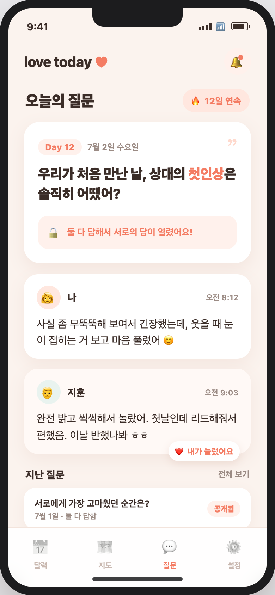
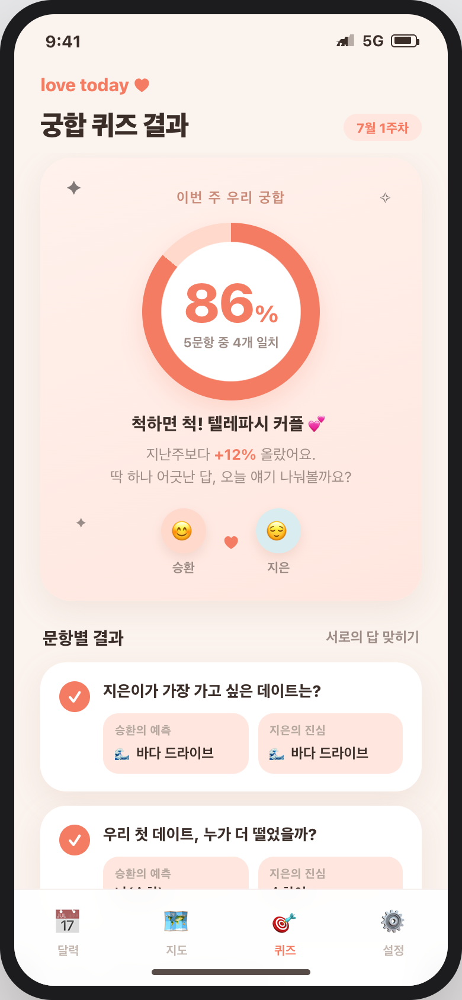
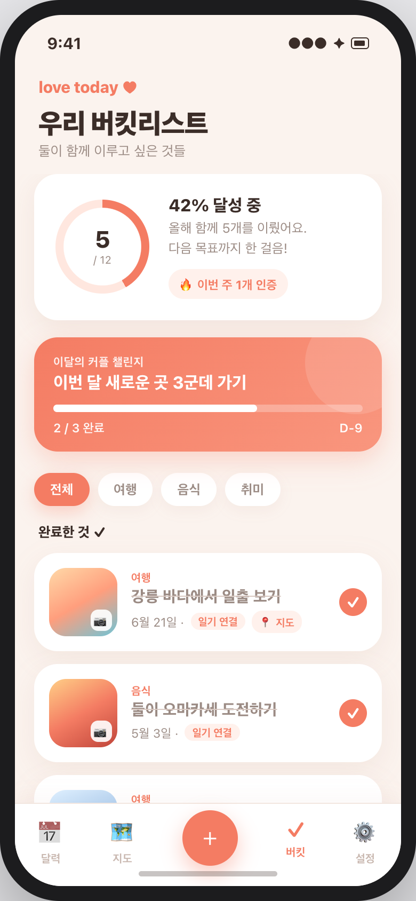
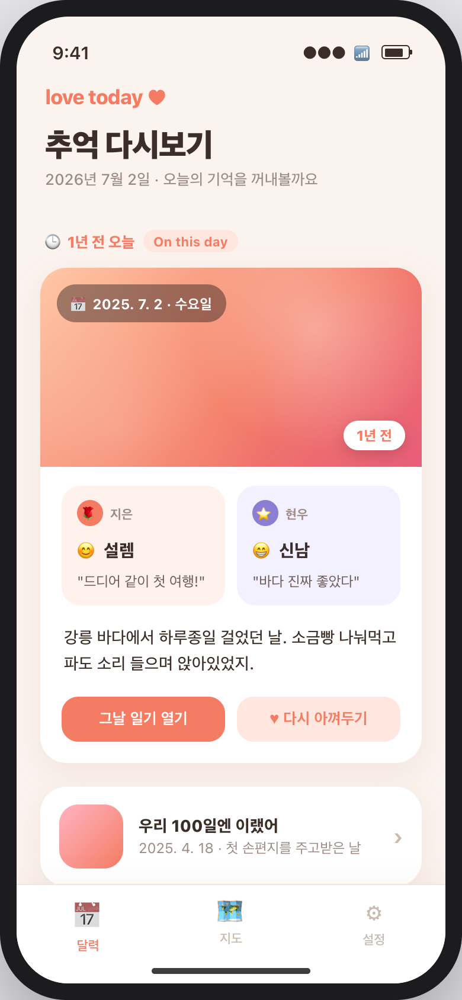
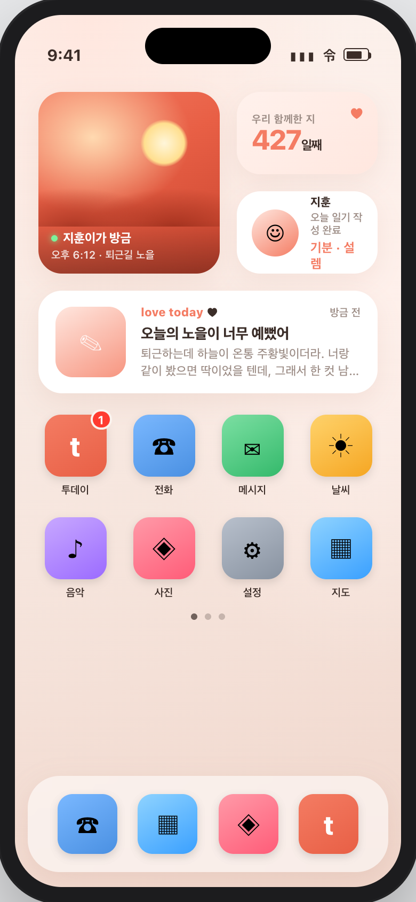

# 투데이(love today) 신규 기능 제안 — 목업 중심 5선

> 현재 앱은 **교환일기** 중심(캘린더 기록·둘 다 쓰면 공개, 지도, 기념일/D-day, 오늘의 기분, 댓글).
> 유사 커플앱과 비교해 "일기만 있는 상태"를 보완할 기능 5개를, **목업 화면 중심**으로 제안한다.
> 공통 원칙: 새 기능은 별도 미니앱이 아니라 **기존 일기·지도·기념일 데이터와 엮여** 재방문과 추억 아카이브를 키운다.

---

## 유사 앱 지형 (무엇을 참고했나)

| 영역 | 대표 앱 | 걔넨 이렇게 | 투데이의 차별화 |
|---|---|---|---|
| 매일 질문 | Paired, Honi | 질문-답이 별도 Q&A 피드로 휘발 | 일기와 같은 **'둘 다 써야 열림'** 문법으로 아카이브화 |
| 궁합/퀴즈 | Paired 퀴즈, 밸런스게임 | 재미 위주, 관계 데이터 안 남음 | 오답을 **일기·지도·기분 데이터**로 대화거리化 |
| 버킷/투두 | 비트윈 추억함, Cupla | 리스트 완료가 체크로 끝 | 완료 순간 **일기 저장 + 지도 핀** 자동 연결 |
| 추억 회고 | Timehop, 비트윈 메모리박스 | 혼자 과거 사진 회고 | 교환일기라 **'그날 서로의 감정'을 나란히** 회고 |
| 홈 위젯 | Locket, Between 위젯 | 사진 한 컷 / D-day에서 멈춤 | 사진+**오늘 일기 여부·상대 기분**까지 홈에 상시 노출 |

---

## 1. 오늘의 질문 (Daily Question)

**컨셉** — 매일 도착하는 친밀도 질문 하나, **둘 다 답하면 서로의 답이 열린다.**

- **비교·차별화**: Paired/Honi는 질문-답이 그 자체로 끝나는 피드. 투데이는 일기와 똑같은 **언락(🔒→🔓)** 문법으로 묶어, 일기를 안 쓴 날에도 한 줄 참여 동기를 만들고 지난 답변을 우리 기록으로 아카이브.
- **핵심 상호작용**: ①둘 다 답해야 상대 답 공개 ②연속 참여 스트릭(🔥12일) ③상대 답에 하트 반응 + 히스토리 회고
- **시너지**: 일기 쓸 말이 없는 날에도 참여하게 해 "매일 열림" 리듬이 끊기지 않게 지킨다.

## 2. 우리 얼마나 알까 — 궁합 퀴즈

**컨셉** — 매주 서로의 답을 맞혀보고 **궁합 %**로 확인, 어긋난 답은 오늘의 대화거리로.

- **비교·차별화**: Paired 퀴즈는 '맞히기' 긴장감이 약하고 밸런스게임은 데이터가 안 남음. 투데이는 예측 게임+궁합%에, **질문을 다녀온 장소·최근 기분에서 자동 생성**하고 오답을 일기/댓글로 연결.
- **핵심 상호작용**: ①상대 답 예측 → 둘 다 풀면 결과 공개 ②궁합 링(%)+문항별 O/X ③어긋난 카드에서 "대화 시작하기"
- **시너지**: 서로를 아는지 확인하는 재미가 일기를 쓸 이유로 이어져 주간 재방문·대화량을 함께 올린다.

## 3. 함께 버킷리스트 & 챌린지

**컨셉** — 둘이 하고 싶은 일을 **사진으로 인증하면 그날 일기·지도에 자동으로 쌓이는** 커플 위시리스트.

- **비교·차별화**: 비트윈·Cupla 투두는 완료가 체크로 끝. 투데이는 완료 순간 인증샷이 **그날 일기로 저장**되고 여행 항목은 **지도에 핀**으로. 이미 있는 일기·지도를 목표로 엮는 게 핵심.
- **핵심 상호작용**: ①체크→카메라 인증→일기/지도 자동 연결 ②진행률 링(12개 중 5개, 42%) ③이달의 커플 챌린지+D-day
- **시너지**: "하고 싶다"는 말이 인증샷·일기로 남아 리텐션과 추억 아카이브를 동시에 만든다.

## 4. 추억 다시보기 — 1년 전 오늘 + 타임캡슐

**컨셉** — "1년 전 오늘"의 일기를 다시 꺼내보고, 미래의 우리에게 **타임캡슐 편지**를 함께 봉인.

- **비교·차별화**: Timehop/비트윈 추억함은 혼자 회고. 투데이는 교환일기라 **'그날 서로의 감정'을 한 카드에 나란히**(나는 설렘, 너는 신남) 보여주고, 타임캡슐은 **둘 다 편지를 넣어야 그날 함께 열리는** 커플 공동 봉인.
- **핵심 상호작용**: ①"1년 전 오늘" 카드→그날 일기로 점프 ②기념일 하이라이트 회고("100일엔 이랬어") ③미래 날짜에 편지 봉인→D-day 자물쇠+개봉 알림
- **시너지**: 이미 쌓인 일기를 재활용해 **개발 비용은 낮고** 감정적 리텐션은 가장 강하다.

## 5. 홈 화면 위젯 (Locket풍)

**컨셉** — 앱을 안 열어도 **상대가 방금 보낸 한 컷 + 오늘의 안부**가 폰 홈에 상시로 뜬다.

- **비교·차별화**: Locket/Paired 위젯은 사진 또는 D-day에서 멈춤. 투데이는 사진뿐 아니라 **상대가 오늘 일기를 썼는지·지금 기분·최근 일기 미리보기**까지 홈에서 읽히는 '오늘 서로의 상태' 위젯.
- **핵심 상호작용**: ①사진 위젯 탭→카메라로 '오늘 한 컷' 답장 ②기분 위젯→오늘 일기로 이동 ③위젯 설정에서 4종(사진/D-day/기분/일기) 크기별 배치
- **시너지**: 앱을 안 열어도 홈에서 서로가 느껴지게 해 관계 밀착과 재방문을 동시에 잡는다.

---

## 우선순위 제안 (임팩트 대비 비용)

| 순위 | 기능 | 임팩트 | 개발 비용 | 메모 |
|---|---|---|---|---|
| ⭐ 1 | 오늘의 질문 | 높음(일일 재방문) | 낮음 | 기존 언락 로직 재사용, 사용자가 직접 언급한 기능 |
| ⭐ 2 | 추억 다시보기 | 높음(감정 리텐션) | 낮음 | 이미 쌓인 일기 데이터만 재활용 |
| 3 | 궁합 퀴즈 | 중간(주간 재방문) | 중간 | 문항 콘텐츠·채점 로직 필요 |
| 4 | 버킷리스트 | 중간(목표 리텐션) | 중간 | 일기·지도 연동 설계 필요 |
| 5 | 홈 위젯 | 높음(상시 노출) | **높음** | WidgetKit 네이티브 → Expo Go 불가, **EAS 빌드 후속** |

**추천 착수 순서**: 오늘의 질문 → 추억 다시보기 → 궁합 퀴즈 → 버킷리스트 → (EAS 빌드 시점에) 홈 위젯.
앞 두 개는 **기존 데이터/로직 재사용으로 비용이 낮으면서 일일·감정 리텐션 효과가 커** 가장 먼저 넣기 좋다.
홈 위젯은 효과가 크지만 네이티브 빌드가 필요하니 알림 푸시(EAS)와 묶어 후속으로.

---

*목업: `docs/planning/feature-mockups/` (HTML 원본 + PNG). Expo Web 없이 순수 HTML로 제작, 실제 앱 톤(코럴/크림) 반영.*
