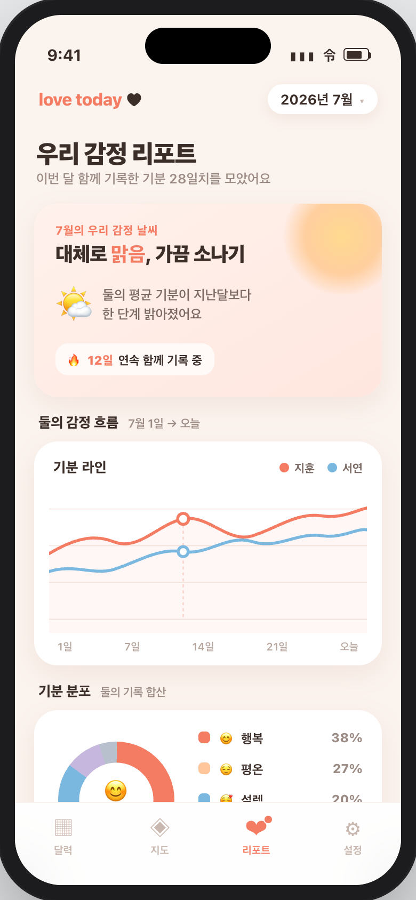
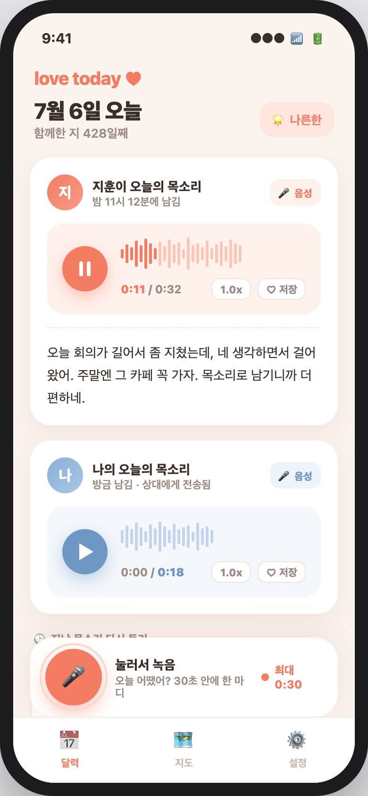
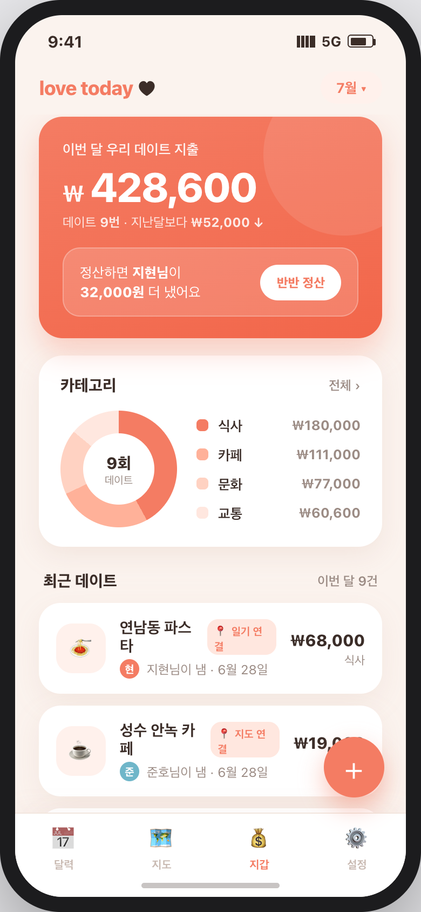
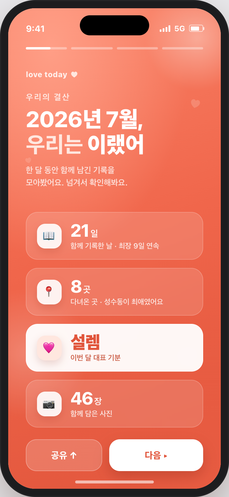
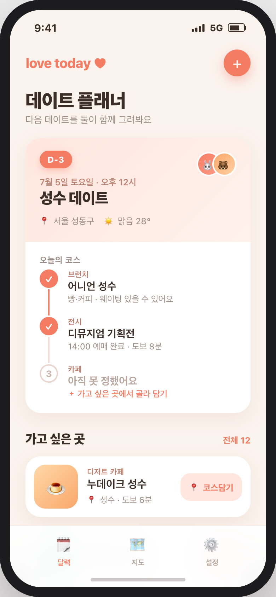

# 투데이(love today) 신규 기능 제안 2탄 — 목업 중심 5선

> 1탄(오늘의질문·궁합퀴즈·버킷리스트·추억다시보기·홈위젯)과 **겹치지 않는** 새로운 5개 방향.
> 이번엔 "글+사진 일기"라는 단일 매체/단일 용도를 넘어서는 축 — **감정 데이터 활용, 새로운 매체(음성), 실용(가계부), 회고(결산), 미래(계획)** — 로 확장했다.
> 공통 원칙은 동일: 기존 일기·지도·기분 데이터와 엮여 재방문과 아카이브를 키운다.

---

## 유사 앱 지형 (무엇을 참고했나)

| 영역 | 대표 앱 | 걔넨 이렇게 | 투데이의 차별화 |
|---|---|---|---|
| 감정 인사이트 | Daylio, Paired 인사이트 | 개인 무드 통계 / 매일 데이터 안 쌓임 | 매일 찍는 기분을 **커플 2인 나란히** + 관계 관점 인사이트 |
| 음성 기록 | 비트윈 음성, Cappuccino | 대화로 흘러가 사라짐 / 혼자 기록 | **날짜별 '그날의 목소리' 아카이브** + 교환 언락 |
| 커플 가계부 | Honeydue, 토스 더치페이 | 생활비 전체라 무거움 / 단발 정산 | **데이트 지출만** 가볍게 + 일기·지도 자동 연결 |
| 회고/결산 | Spotify Wrapped, 1SE | 개인 통계 / 시각 몽타주 | **커플 공동 결산**(장소·감정까지) + 공유 카드 |
| 데이트 계획 | 데이트팝, Cupla 플랜 | 코스 추천/일정만, 기록과 단절 | **계획→기록 자동 전환**(위시핀→코스→일기·지도) |

---

## 6. 우리 감정 리포트 — 무드·관계 인사이트

**컨셉** — 매일 찍는 두 사람의 '기분'을 **감정 날씨·흐름·인사이트**로 보여주는 관계 대시보드.

- **비교·차별화**: Daylio는 나 혼자 통계, Paired 인사이트는 매일 데이터가 안 쌓임. 투데이는 **이미 매일 기록되는 기분**을 커플 2인(라인 2줄·합산 도넛)으로 시각화하고 "함께 있던 주말에 기분이 좋았다"식 관계 인사이트로 연결.
- **핵심 구성**: ①"이번 달 감정 날씨" 요약(+스트릭) ②두 사람 기분 흐름 라인 + 분포 도넛 ③가장 행복했던 날·한 줄 인사이트
- **시너지**: 기존 기분 데이터 재활용이라 **비용 낮음**. "우리 관계가 어땠나"를 감성으로 되돌아보게 해 재방문↑.

## 7. 음성 일기 — 보이스 답장

**컨셉** — 글 대신 **그날의 목소리 30초**를 서로에게 남기는 교환일기.

- **비교·차별화**: 비트윈/카톡 음성은 대화로 흘러가 사라짐, Cappuccino는 혼자 기록. 투데이는 **하루당 목소리 한 마디를 날짜별로 아카이브**하고, 서로 남겨야 들리는 **교환 언락** 구조로 상호 동기 부여.
- **핵심 상호작용**: ①하단 큰 버튼으로 30초 녹음 ②파형 위 재생·배속·하트 저장 ③'지난 목소리 다시 듣기'로 회고
- **시너지**: 글로 못 담는 톤·피곤함까지 목소리에 남고, 떨어져 있어도 '그날의 목소리'가 쌓여 나중에 함께 듣는 추억이 된다.

## 8. 데이트 가계부 — 우리 데이트 지갑

**컨셉** — 데이트마다 쓴 돈을 **그날 일기·지도와 묶어** 쌓고, 반반 정산까지 끝내는 커플 지갑.

- **비교·차별화**: Honeydue/비트윈 가계부는 생활비 전체라 무겁고, 토스 더치페이는 단발 정산. 투데이는 **데이트 지출만** 가볍게, 이미 쌓인 다녀온 곳·일기와 자동 연결돼 입력이 적고 "이번 달 428,600원·9번 데이트" 히스토리로 남음.
- **핵심 상호작용**: ①지출 추가 시 그날 방문지 자동 추천→원터치 연결 ②'반반 정산' 한 번으로 차액 계산 ③카테고리 도넛(식사/카페/문화/교통)
- **시너지**: 따로 가계부를 켜지 않아도 데이트 기록이 돈 이야기·정산까지 알아서 이어진다.

## 9. 월말·연말 결산 — "우리 이랬어" (Wrapped)

**컨셉** — 한 달/한 해를 자동 요약해 **Wrapped처럼 넘겨보고 한 장으로 공유**하는 커플 공동 결산.

- **비교·차별화**: Spotify Wrapped는 개인 소비, 1SE는 시각 몽타주. 투데이는 두 사람 데이터를 합쳐 **함께 기록한 날·다녀온 곳·대표 기분·사진 수**까지 감정과 장소를 엮어 요약 — 통계가 아니라 관계의 기록.
- **핵심 상호작용**: ①좌우 스와이프 슬라이드(상단 진행 점) ②마지막 장 "공유↑"로 결산 이미지 자동 생성 ③월말·연말 자동 푸시
- **시너지**: 매달 관계를 되돌아보고 자랑하고 싶게 만들어 **리텐션 + 자연 공유(신규 유입)** 동시에.

## 10. 데이트 플래너 — 다음 데이트 & 가고 싶은 곳

**컨셉** — 지나간 기록만 남던 앱에 **'앞으로의 데이트'를 둘이 함께 그리는** 공간.

- **비교·차별화**: Cupla는 일정만·코스는 못 짜고, 데이트팝은 추천은 좋지만 우리 기록과 단절. 투데이는 **계획→기록이 자연스럽게 이어짐** — 저장한 '가고 싶은 곳' 위시핀이 코스 스텝으로 담기고, 데이트 종료 시 그날 일기·지도로 자동 전환.
- **핵심 상호작용**: ①코스 타임라인 체크(브런치→전시→카페) ②위시핀 → '코스담기' 한 번 ③D-day 카드 + 지도 연동
- **시너지**: 흩어진 앱(지도 저장·예약·메신저) 오가던 '다음에 뭐하지'를 투데이 안에서 끝내고, 그 계획이 곧 추억 기록이 된다.

---

## 우선순위 제안 (임팩트 대비 비용)

| 순위 | 기능 | 임팩트 | 개발 비용 | 메모 |
|---|---|---|---|---|
| ⭐ 1 | 감정 리포트 | 높음(재방문·차별화) | **낮음** | 기존 기분 데이터만 시각화 |
| ⭐ 2 | 월말·연말 결산 | 높음(리텐션+자연공유) | 낮~중 | 기존 데이터 집계+공유 카드 |
| 3 | 데이트 플래너 | 중~높음(미래 방문 이유) | 중간 | 지도·일기 연동 설계 필요 |
| 4 | 데이트 가계부 | 중간(실용·정산) | 중간 | 금액 입력 UX + 정산 로직 |
| 5 | 음성 일기 | 높음(감성·몰입) | **중~높음** | 녹음/재생·오디오 저장·스토리지 |

**추천 착수 순서**: 감정 리포트 → 월말 결산 → 데이트 플래너 → 데이트 가계부 → 음성 일기.
앞 두 개는 **이미 쌓인 데이터를 재활용**해 비용 대비 임팩트가 가장 크다(기분 시각화 / 자동 집계·공유).
음성 일기는 감성·몰입 효과가 크지만 오디오 녹음·스토리지 인프라가 필요해 뒤로.

> **1탄과 묶어 보면** — '오늘의 질문'(1탄)으로 매일을 채우고, '감정 리포트·월말 결산'(2탄)으로 그 데이터를 되돌아보게 하는 **입력→회고 루프**가 가장 자연스러운 조합이다.

---

*목업: `docs/planning/feature-mockups/6~10` (HTML 원본 + PNG). 순수 HTML로 제작, 실제 앱 톤(코럴/크림) 반영.*
