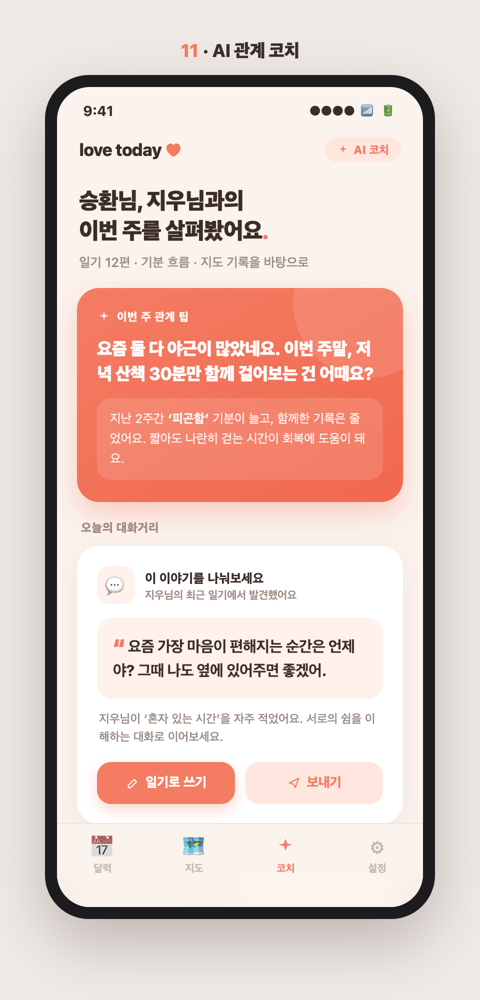
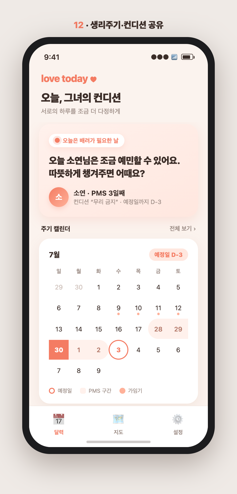
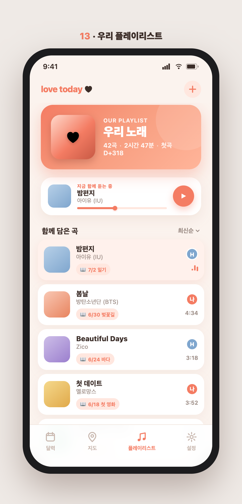
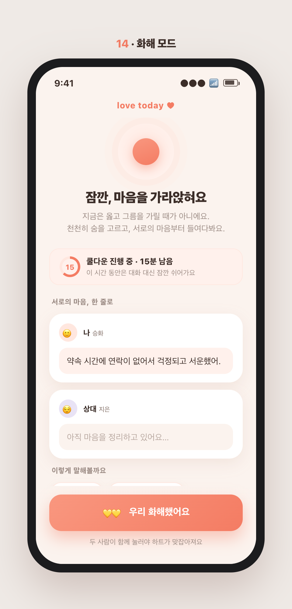
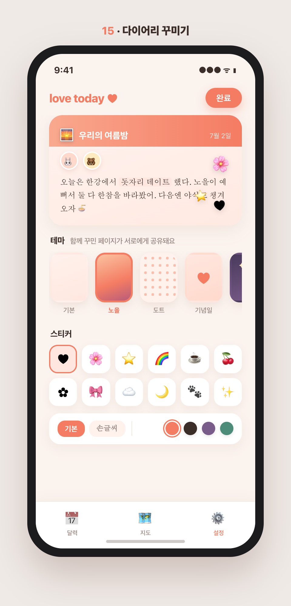

# 투데이(love today) 신규 기능 제안 3탄 — 목업 중심 5선 (11~15)

> 1탄(1~5)·2탄(6~10)과 **겹치지 않는** 세 번째 5개. 이번엔 다른 앱을 폭넓게 참고해 **관계 케어·건강·감성 커스터마이즈** 축까지 확장했다.
> 목업 상단에 **번호를 직접 표기**해 어떤 게 몇 번인지 바로 보이게 했다.

---

## 유사 앱 지형 (무엇을 참고했나)

| 번호 | 영역 | 대표 앱 | 걔넨 이렇게 | 투데이의 차별화 |
|---|---|---|---|---|
| 11 | 관계 코칭 | Paired, Lasting, Relish | 전문가 콘텐츠를 모두에게 동일하게 | **우리 실제 기록 기반 개인화** + 제안이 곧 일기로 |
| 12 | 주기·컨디션 | Flo/Clue 파트너, 헤이문 | 의학 데이터 그대로 노출 | 수치 대신 **배려 톤·챙김 행동** 중심, 일기와 연동 |
| 13 | 음악 공유 | Spotify Blend, Airbuds | 취향 섞기/실시간 청취까지만 | 곡을 **일기·날짜·장소에 묶어** 추억의 앵커로 |
| 14 | 관계 케어 | Lasting, Gottman, Relish | 상담식 설문·리포트로 무거움 | 다툰 순간 맥락(일기·기분) 위에서 **가벼운 화해 리추얼** |
| 15 | 꾸미기 | 다꾸/굿노트, 폰꾸, 카톡테마 | 혼자 꾸밈 / 앱 전체만 변경 | **둘이 함께 꾸민 한 장이 공유** + 기념일 자동 테마 |

---

## 11. AI 관계 코치 & 오늘의 대화거리

**컨셉** — 우리 일기·기분·지도 기록을 AI가 읽고 **주간 팁·대화거리·맞춤 데이트를 먼저 제안**하는 능동형 코치.

- **비교·차별화**: Paired/Lasting은 전문가 콘텐츠를 모두에게 똑같이 밀어줌. 투데이는 **우리 실제 기록 기반 개인화**("최근 일기에 혼자 있는 시간을 자주 적었어요")이고, 코칭이 곧바로 일기 작성으로 이어져 관찰→제안→기록 루프가 닫힘.
- **핵심 상호작용**: ①근거 있는 주간 관계 팁 ②상대 일기에서 뽑은 대화거리 → '일기로 쓰기/보내기' ③취향·날씨 반영 맞춤 데이트 → '계획 세우기'
- **시너지**: 읽기만 하던 데이터가 관계를 움직이는 행동 제안이 되고, 그 제안이 다시 일기가 된다.

## 12. 생리주기 · 컨디션 함께 알기

**컨셉** — 그녀의 주기·컨디션을 **"배려가 필요한 날"로 은은하게** 전하고, 상대에게 챙김 액션을 제안.

- **비교·차별화**: Flo/Clue 파트너 모드는 의학 데이터를 그대로 노출, 헤이문은 캘린더 중심이라 '그래서 뭘 해야 하나'가 빠짐. 투데이는 **수치 대신 컨디션 톤("무리 금지")과 챙김 행동("따뜻한 거 챙겨주기")**만 전하고 일기 흐름에 녹임. 공유 범위 조절로 프라이버시 배려.
- **핵심 상호작용**: ①컨디션 칩 → 상대 홈에 '배려가 필요한 날' 카드 ②미니 캘린더에 예정일 D-3·PMS·가임기 부드럽게 표시 ③챙김 제안 → '다정한 한마디 보내기'
- **시너지**: 정보가 아니라 배려를 공유해, 주기 앱을 따로 켜지 않아도 서로의 하루를 다정하게 챙긴다.

## 13. 우리 플레이리스트 · 오늘의 노래

**컨셉** — 둘이 쌓은 곡이 **그날 일기·날짜와 엮여**, 노래를 들으면 그날 추억이 함께 재생되는 커플 사운드트랙.

- **비교·차별화**: Spotify Blend는 취향 섞기까지, Airbuds는 실시간 청취 공유에 그침. 투데이는 곡을 **일기·날짜·장소에 묶어** "6/30 벚꽃길에 담은 봄날"처럼 추억 앵커로 만듦 — 플레이리스트가 곧 둘만의 타임라인.
- **핵심 상호작용**: ①일기 작성 중 '오늘의 노래' 첨부 → 자동 누적 ②곡 카드의 날짜 태그 탭 → 그날 일기로 점프 ③'지금 함께 듣는 중' 커플 동기화 청취
- **시너지**: 음악은 커플이 이미 매일 쓰는 매체 — 일기에 배경음을 입혀 재방문·재미를 동시에.

## 14. 화해 모드 · 관계 케어

**컨셉** — 다툰 순간, 비난 대신 **마음을 가라앉히고 구조화된 화해**로 이끄는 커플 케어.

- **비교·차별화**: Lasting/Gottman은 상담식 설문·리포트로 무겁고 진입장벽이 높음. 투데이는 교환일기라 **다툰 순간 감정이 이미 일기·기분에 기록**돼 있어 설문 없이 바로 화해 흐름으로. 상담이 아니라 따뜻한 커플 톤(하트 맞잡기 리추얼).
- **핵심 상호작용**: ①쿨다운 타이머로 대화 잠깐 멈춤 ②'나 전달법' 한 줄 카드(상대 것은 준비될 때까지 흐림) ③둘이 함께 눌러야 확정되는 '우리 화해했어요' + 주간 체크인
- **시너지**: 리텐션의 최대 적인 '갈등 이탈'을 앱 안에서 부드럽게 봉합한다.

## 15. 다이어리 꾸미기 · 테마 & 스티커

**컨셉** — 우리 일기를 둘이 함께 **다꾸(다이어리 꾸미기)**하는 커플 감성 커스터마이즈.

- **비교·차별화**: 굿노트/다꾸 앱은 혼자 꾸민 걸 나중에 보여주고, 카톡 테마는 앱 전체만 바뀜. 투데이는 교환일기라 **한 사람이 붙인 스티커·테마가 그날 페이지 그대로 상대에게 공유**돼 "같이 꾸민 한 장"이 남고, 기념일엔 테마가 자동으로 바뀜.
- **핵심 상호작용**: ①스티커 끌어다 붙이기(결과가 상대에게도 보임) ②테마 가로 스크롤로 커버/배경 즉시 교체(무료+시즌) ③글꼴·색으로 그날 무드 지정
- **시너지**: 평범한 일기 한 장이 "둘이 함께 만든 작품"이 되어 다시 열어보고 싶은 페이지가 된다.

---

## 우선순위 제안 (임팩트 대비 비용)

| 순위 | 번호·기능 | 임팩트 | 개발 비용 | 메모 |
|---|---|---|---|---|
| ⭐ 1 | 15 다이어리 꾸미기 | 높음(감성·차별화·수익화) | 낮~중 | 시즌 테마 유료화로 매출 여지 |
| ⭐ 2 | 12 생리주기·컨디션 | 높음(일상 필수·타깃 명확) | 중간 | 주기 계산+프라이버시 설계 |
| 3 | 11 AI 관계 코치 | 높음(개인화·재방문) | 중~높음 | LLM 연동·비용·프롬프트 설계 |
| 4 | 14 화해 모드 | 중~높음(갈등 이탈 방지) | 중간 | 민감 UX·카피 신중히 |
| 5 | 13 우리 플레이리스트 | 중간(감성) | **높음** | Spotify/Apple Music API·저작권 |

**추천 착수 순서**: 다이어리 꾸미기 → 생리주기·컨디션 → AI 관계 코치 → 화해 모드 → 우리 플레이리스트.
꾸미기는 감성 차별화 + **시즌 테마 유료화로 수익 실험**까지 가능하고, 생리주기·컨디션은 커플 앱에서 만족도가 높은 실사용 기능이라 앞에 뒀다. 플레이리스트는 외부 음원 API·저작권 이슈로 뒤로.

> **1~3탄 통합 시각** — 매일 채우는 입력(오늘의질문·음성일기), 되돌아보는 회고(감정리포트·월말결산·추억), 관계를 돌보는 케어(AI코치·화해모드·컨디션), 꾸미고 즐기는 재미(꾸미기·플레이리스트·퀴즈)로 묶인다. 한 번에 다 만들 필요 없이 **입력 1 + 회고 1 + 케어/재미 1**을 골라 시작하는 걸 권한다.

---

*목업: `docs/planning/feature-mockups/11~15` (HTML 원본 + PNG, 상단 넘버링 포함). 순수 HTML 제작, 앱 톤(코럴/크림) 반영.*
