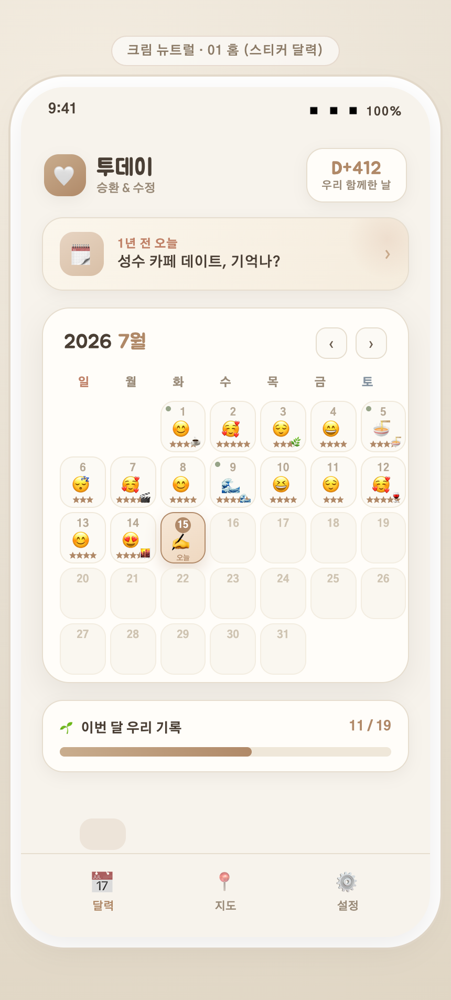
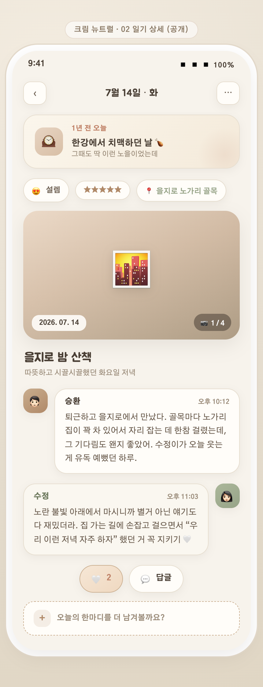
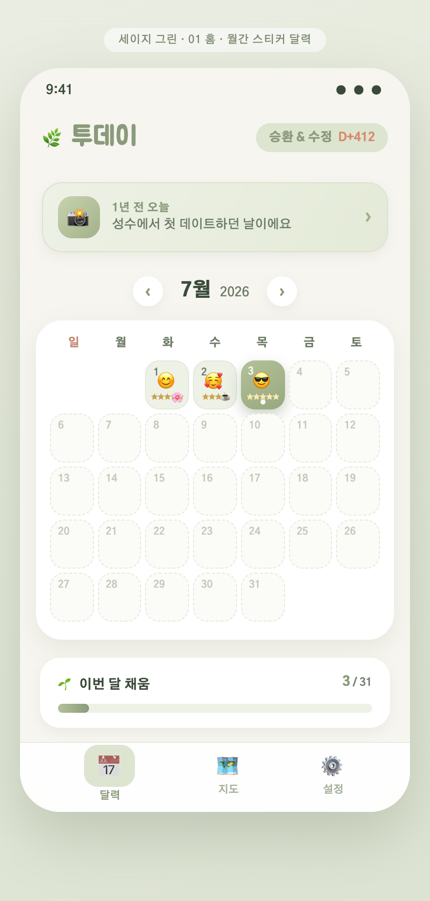
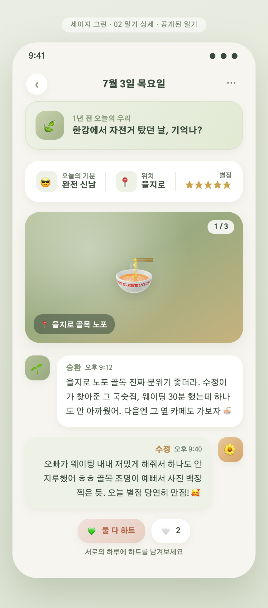
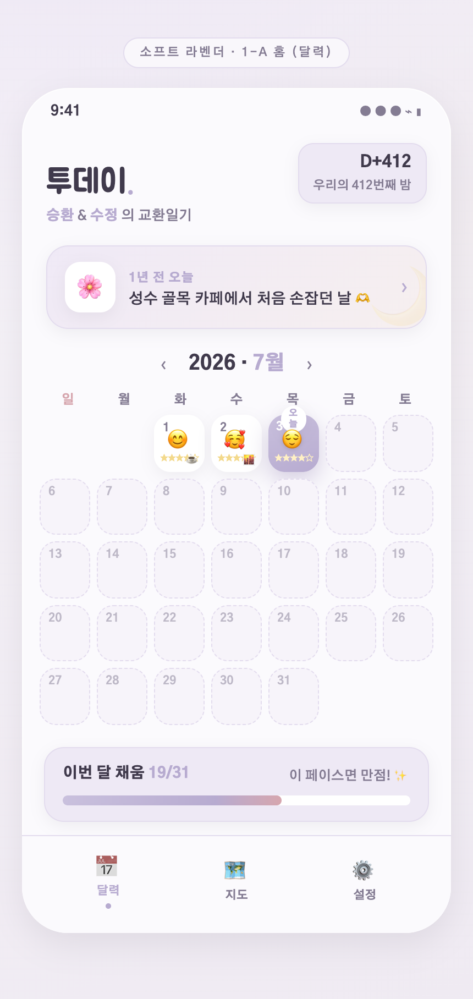
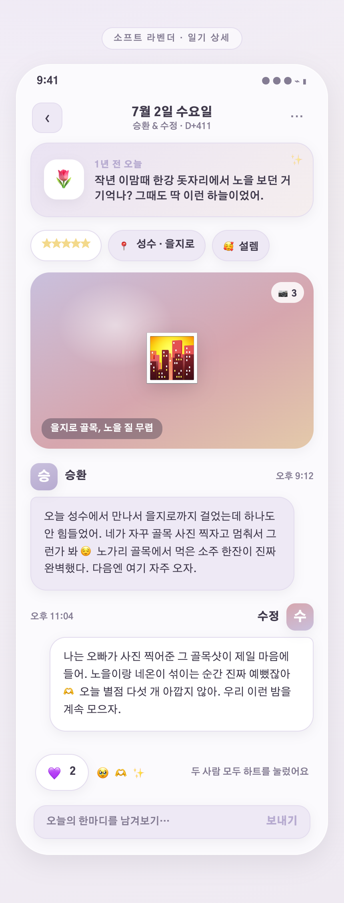
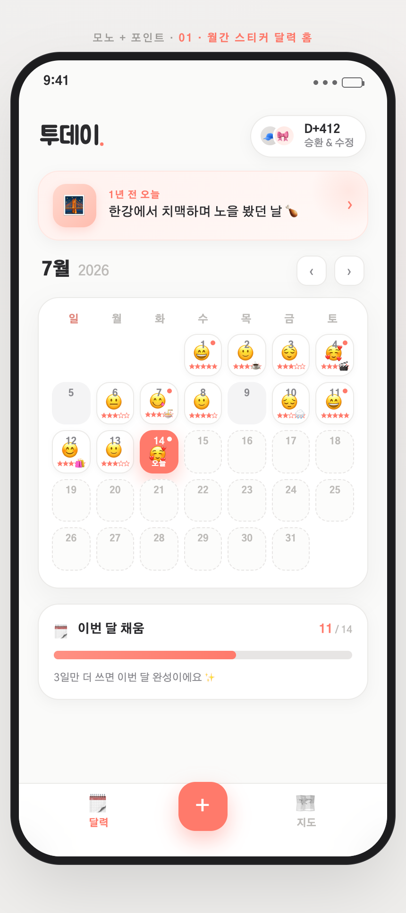
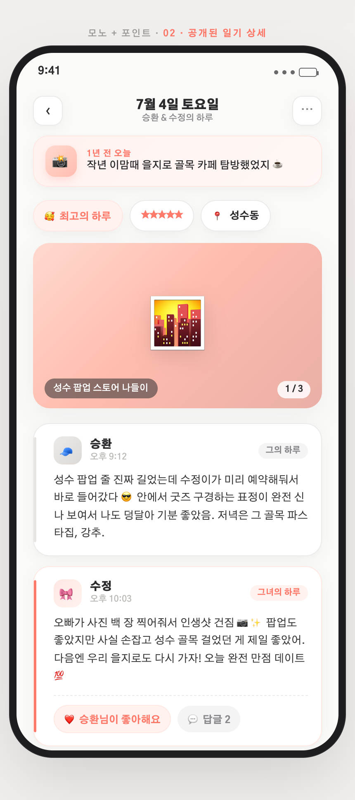

# 투데이 · 1-A 스티커 달력 리스타일 (20대 커플 타겟)

가장 반응 좋았던 **1-A 스티커 달력**을 20대 커플 타겟으로 다시 칠했다.
방향은 **"깔끔하면서 귀여운, 유치하지 않게"** — 유치한 핑크를 빼고 채도 낮은 세련된 팔레트 4색으로.

## 공통 원칙
- 🎨 채도 낮은 톤 · 넉넉한 여백 · 라운드 코너 · 은은한 그림자
- 🧸 귀여움은 **절제된 이모지·작은 스탬프·라운드 셰이프**로만 (유치한 손글씨 남발 X)
- ✍️ 폰트: 본문 깔끔한 산세리프(Gothic A1) + 로고에만 라운드 포인트(Jua)
- 👫 커플 이름: **승환 & 수정**
- 구조는 원본 1-A 유지 (월간 스티커 달력 홈 + 공개 일기 상세)

> 각 버전 = **홈(달력)** + **공개 일기 상세** 2화면. 이미지 아래 🔗 로 실제 화면(HTML)도 열림.

---

## ① 크림 뉴트럴
아이보리·카멜 톤의 따뜻한 종이 같은 미니멀. 정갈하고 고급스러운 무드. **가장 무난하고 편안**.

🔗 [홈 열기](https://htmlpreview.github.io/?https://github.com/seunghw2/couple-diary/blob/main/docs/planning/1a-restyle/mockups/cream-neutral/01-home.html) · [상세 열기](https://htmlpreview.github.io/?https://github.com/seunghw2/couple-diary/blob/main/docs/planning/1a-restyle/mockups/cream-neutral/02-detail.html)

---

## ② 세이지 그린
톤다운 세이지·올리브 + 크림. 차분하고 자연스러운, 요즘 20대에게 트렌디한 색. **산뜻+은은한 귀여움**.

🔗 [홈 열기](https://htmlpreview.github.io/?https://github.com/seunghw2/couple-diary/blob/main/docs/planning/1a-restyle/mockups/sage-green/01-home.html) · [상세 열기](https://htmlpreview.github.io/?https://github.com/seunghw2/couple-diary/blob/main/docs/planning/1a-restyle/mockups/sage-green/02-detail.html)

---

## ③ 소프트 라벤더
뮤트 라벤더·모브를 옅게 얹은 웜그레이 베이스. 은은하고 감각적인 무드보드 느낌. **가장 몽환·감성**.

🔗 [홈 열기](https://htmlpreview.github.io/?https://github.com/seunghw2/couple-diary/blob/main/docs/planning/1a-restyle/mockups/soft-lavender/01-home.html) · [상세 열기](https://htmlpreview.github.io/?https://github.com/seunghw2/couple-diary/blob/main/docs/planning/1a-restyle/mockups/soft-lavender/02-detail.html)

---

## ④ 모노 + 포인트
오프화이트·그레이 무채색 베이스 + **소프트 코럴 한 색**만 포인트. 요즘 감성 미니멀 앱. **가장 모던·깔끔**.

🔗 [홈 열기](https://htmlpreview.github.io/?https://github.com/seunghw2/couple-diary/blob/main/docs/planning/1a-restyle/mockups/mono-accent/01-home.html) · [상세 열기](https://htmlpreview.github.io/?https://github.com/seunghw2/couple-diary/blob/main/docs/planning/1a-restyle/mockups/mono-accent/02-detail.html)

---

## 리드 추천
20대 · 깔끔+귀여움 · 유치하지 않게 라는 조건엔 **② 세이지 그린**이 제일 잘 맞는다. 성별 안 타고, 요즘 감성이며, 자연 모티브(🌿🌱)로 유치하지 않게 귀엽다.
더 모던·세련 쪽을 원하면 **④ 모노 + 포인트**가 강력한 대안. ①은 편안·무난, ③은 가장 개성 있는 감성.

한 가지만 고르면 → **② 세이지 그린**. 컬러만 갈아끼우면 되는 구조라 나중에 톤 바꾸는 것도 쉬움.
