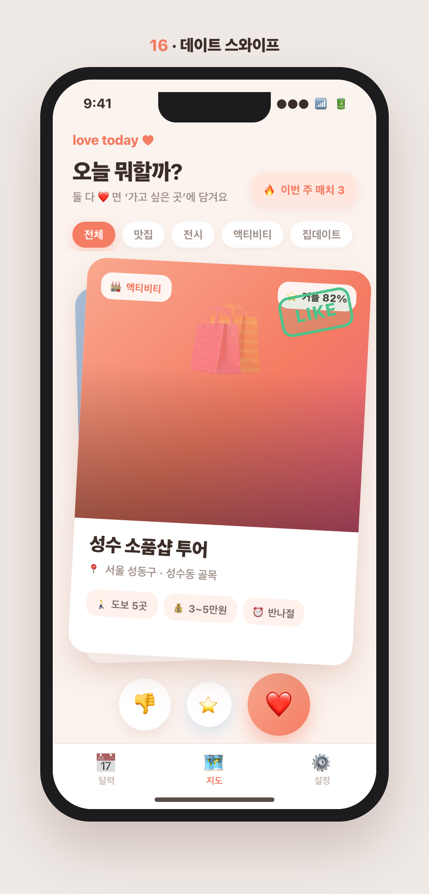
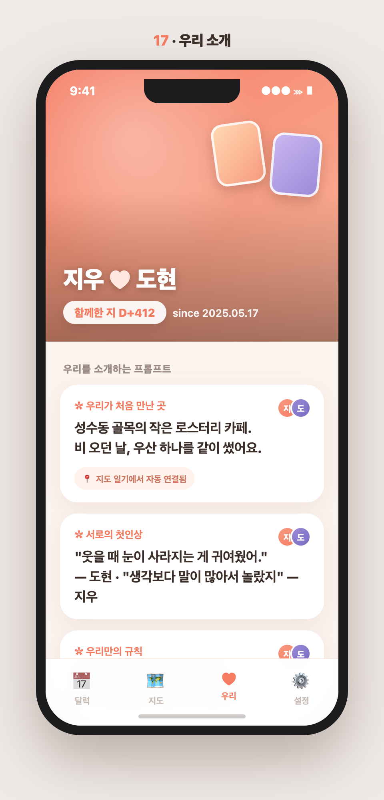
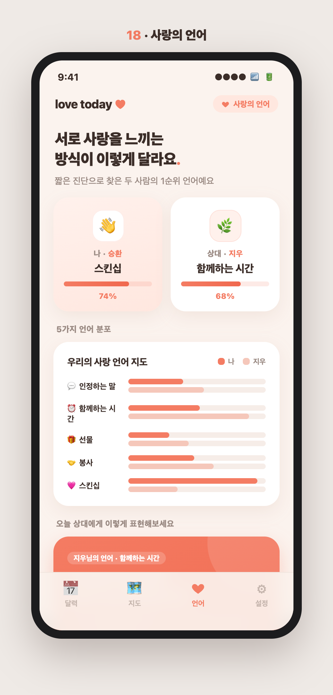
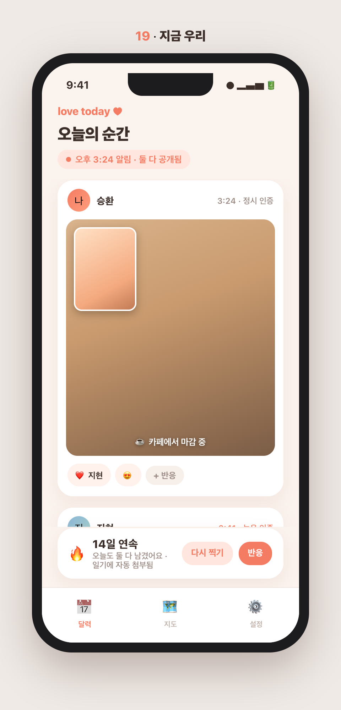
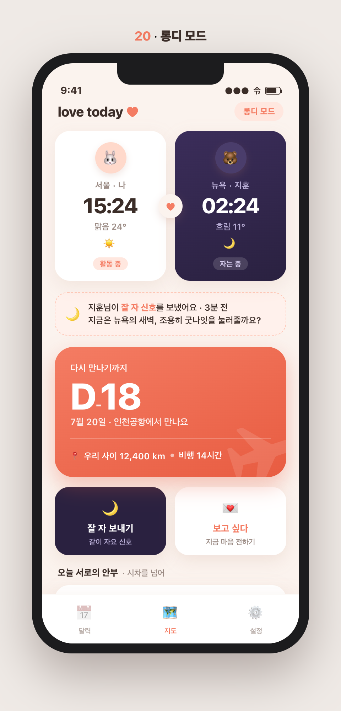

# 투데이(love today) 신규 기능 제안 4탄 — 목업 중심 5선 (16~20)

> 1~3탄(1~15)과 **겹치지 않는** 네 번째 5개. 이번엔 실제 **데이트·소개 앱의 검증된 메커니즘**(틴더 스와이프·힌지 프롬프트·러브랭귀지·BeReal·롱디)을 커플 교환일기에 맞게 가져왔다.
> 목업 상단에 번호를 직접 표기했다.

---

## 유사 앱 지형 (무엇을 참고했나)

| 번호 | 참고 메커니즘 | 대표 앱 | 걔넨 이렇게 | 투데이의 차별화 |
|---|---|---|---|---|
| 16 | 스와이프 매칭 | 틴더, 범블 | '사람'을 스와이프·매칭 | '우리 데이트'를 스와이프, 둘 다 좋아요=합의 |
| 17 | 프로필 프롬프트 | 힌지, Pairs | 개인이 자신을 소개(소개팅) | '커플 공동' 프로필, 일기·지도로 자동 채움 |
| 18 | 사랑의 언어 | Paired, 5 Love Languages | 진단 결과 카드에서 멈춤 | 진단→매일 실천→일기 기록 루프 |
| 19 | 이중 카메라 순간 | BeReal, 스냅챗 | 혼자 올리면 끝, 휘발성 | 커플 2인 상호 언락 + 그날 일기에 영구 편입 |
| 20 | 롱디·세계시계 | Between, Cupla | D-day·시계 나열만 | 재회 카운트다운 주인공 + 시차 배려 UX |

---

## 16. 데이트 스와이프 — "오늘 뭐할까"

**컨셉** — 데이트 아이디어/장소를 **틴더식으로 넘겨보고(👎/❤️), 둘 다 좋아요=매치**되어 자동으로 '가고 싶은 곳'에 담기는 발견·합의 도구.

- **비교·차별화**: 틴더/범블은 '사람'을 매칭, 이건 '우리 데이트'를 매칭. 데이트팝이 혼자 고르는 카탈로그라면 투데이는 **두 스와이프가 교차할 때만 결정되는 합의 엔진**. 매치 전엔 서로 뭘 눌렀는지 안 보여 눈치싸움 없이 솔직하게.
- **핵심 상호작용**: ①카드 좌우 스와이프+하단 원형 버튼(뒤 카드 겹침) ②둘 다 좋아요→"매치!"→자동 저장+"이번 주 매치 3" ③카테고리 필터(맛집·전시·액티비티·집데이트)
- **시너지**: "뭐 먹지/뭐 하지" 무한 핑퐁을 둘 다 설레는 것만 남는 3초 스와이프로 끝낸다. (데이트플래너는 '언제', 이건 '무엇을' 담당)

## 17. 우리 소개 · 만난 이야기

**컨셉** — 힌지식 프롬프트로 만드는 **'우리 커플 공동 프로필'** — 만난 이야기, 프롬프트 답변, 관계 마일스톤 타임라인.

- **비교·차별화**: 힌지/틴더 프롬프트는 개인이 자신을 파는 소개팅용. 투데이는 **두 사람 공동 프로필**(각 카드에 양쪽 아바타 병치)이고, 이미 쌓인 **일기·지도·기념일로 자동 채움**("처음 만난 곳"은 지도 일기에서). 소개가 아니라 관계의 정체성 아카이브.
- **핵심 상호작용**: ①프롬프트에 두 사람이 각자 답(한 카드에 병치) ②지도·기념일 자동 연결 배지 ③마일스톤 타임라인(지난 순간+다가올 기념일)
- **시너지**: 흩어진 일기·장소·기념일을 '우리를 소개하는 한 페이지'로 묶어, 자랑하고 싶은 커플 명함이 된다.

## 18. 사랑의 언어 — 우리 표현 방식

**컨셉** — '5가지 사랑의 언어' 진단으로 서로가 사랑을 느끼는 방식을 파악하고, **상대 언어에 맞춘 오늘의 실천**을 매일 제안.

- **비교·차별화**: Paired·5 Love Languages 공식 앱은 대개 진단 결과 카드에서 멈춤. 투데이는 진단을 시작점으로만 쓰고 **"실천 제안→완료 체크→일기 기록→스트릭"** 루프로 돌림. 기존 일기·기분·지도 데이터와 붙어 표현이 실제 기록으로 쌓임.
- **핵심 상호작용**: ①두 사람 1순위 언어 요약(나=스킨십/상대=함께하는 시간) ②5언어 분포 2줄 막대 비교 ③오늘의 실천 카드(+완료/일기로 남기기)
- **시너지**: 진단으로 끝나지 않고 "상대가 느끼는 방식"을 매일 작은 행동과 일기로 실천하게 해 표현을 습관으로 바꾼다.

## 19. '지금 우리' — 듀얼 셀피

**컨셉** — 매일 **랜덤 시각 알림("📸 지금이야!")**에 둘 다 2분 안에 전·후면 동시 촬영. 둘 다 올려야 공개되고 그날 일기에 자동 첨부.

- **비교·차별화**: BeReal은 혼자 올리면 끝·친구 피드용, Locket은 홈위젯 상시노출. 투데이는 **커플 2인이 서로를 언락하는 데일리 리추얼**이고, 꾸밈 없는 순간이 **그날 일기 엔트리로 자동 흡수**돼 별도 기록 없이 하루가 남음.
- **핵심 상호작용**: ①상호 언락(안 올리면 상대 것도 블러) ②정시/늦은 인증·다시 찍기 표시로 진짜 순간의 텍스처 ③커플 스트릭(🔥14일)+사진별 반응
- **시너지**: 따로 마음먹지 않아도 하루 한 번 '지금 우리'가 저절로 일기로 남는다. (홈위젯5·음성일기7과 매체·맥락이 다름)

## 20. 롱디 모드 — 장거리 연애 케어

**컨셉** — 두 도시의 **시각·날씨·거리**를 나란히, **재회 D-day**를 중심에 둔 "떨어져 있어도 붙어있는" 대시보드.

- **비교·차별화**: Between/Cupla는 D-day·세계시계를 나열만, 세계시계 위젯은 감정이 없음. 투데이는 ①재회 카운트다운을 화면의 주인공으로, ②상대 도시가 새벽이면 '자는 중'으로 굿나잇을 유도하는 **시차 배려 UX**, ③기존 일기·기분을 "오늘 서로의 안부"로 끌어옴.
- **핵심 상호작용**: ①'잘 자 보내기' 동시 취침 신호 ②'보고 싶다' 원탭 전송(시차 무관) ③재회 D-day 카드(거리·비행시간)
- **시너지**: 거리와 시차를 '불편'에서 매일 확인하고 싶은 '우리만의 화면'으로 바꿔 롱디 커플을 붙잡는다.

---

## 우선순위 제안 (임팩트 대비 비용)

| 순위 | 번호·기능 | 임팩트 | 개발 비용 | 메모 |
|---|---|---|---|---|
| ⭐ 1 | 16 데이트 스와이프 | 높음(재미·합의·재방문) | 낮~중 | 콘텐츠 덱 + 매칭 로직, 지도 연동 |
| ⭐ 2 | 17 우리 소개 | 중~높음(정체성·공유) | 낮음 | 기존 데이터 자동 채움, 정적 화면 |
| 3 | 18 사랑의 언어 | 중~높음(실천 습관) | 중간 | 진단 문항 + 실천 큐레이션 |
| 4 | 19 지금 우리 | 높음(데일리 리추얼) | 중~높음 | 카메라·푸시 타이밍·저장 인프라 |
| 5 | 20 롱디 모드 | 중간(타깃 한정·깊음) | 중간 | 롱디 커플에겐 강력, 그 외엔 선택 |

**추천 착수 순서**: 데이트 스와이프 → 우리 소개 → 사랑의 언어 → 지금 우리 → 롱디 모드.
16·17은 **기존 데이터/지도와 자연스럽게 붙고 비용이 낮으면서** 재미·정체성으로 재방문을 만든다. 19는 데일리 리텐션 효과가 크지만 카메라·푸시 인프라가 필요하고, 20은 롱디 커플에겐 강력하나 타깃이 한정적이라 뒤로.

> **1~4탄 통합 시각(총 20개)** — 축으로 묶으면 ①매일 채우기(오늘의질문·음성일기·지금우리) ②되돌아보기(감정리포트·월말결산·추억) ③관계 돌보기(AI코치·화해모드·사랑의언어·컨디션) ④함께 놀기(궁합퀴즈·데이트스와이프·플레이리스트·꾸미기) ⑤정체성·상황(우리소개·롱디·홈위젯). **한 번에 다 만들 필요 없이, 각 축에서 하나씩 골라 시작하는 걸 권한다.**

---

*목업: `docs/planning/feature-mockups/16~20` (HTML 원본 + PNG, 상단 넘버링 포함). 순수 HTML 제작, 앱 톤(코럴/크림) 반영.*
