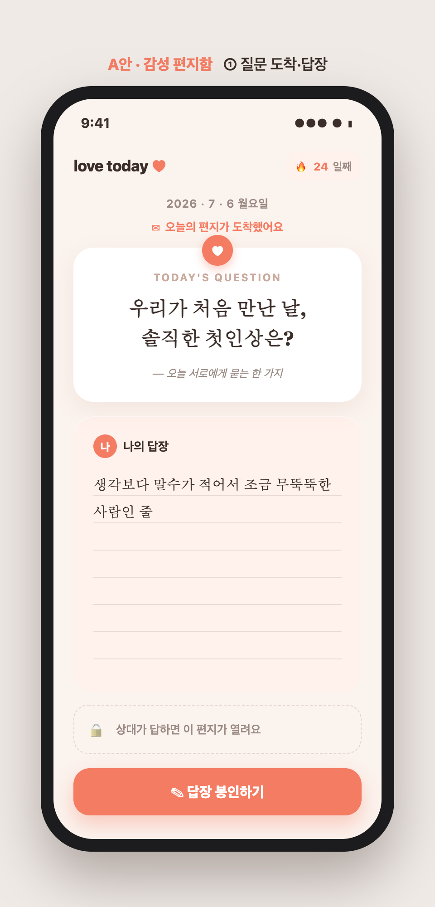
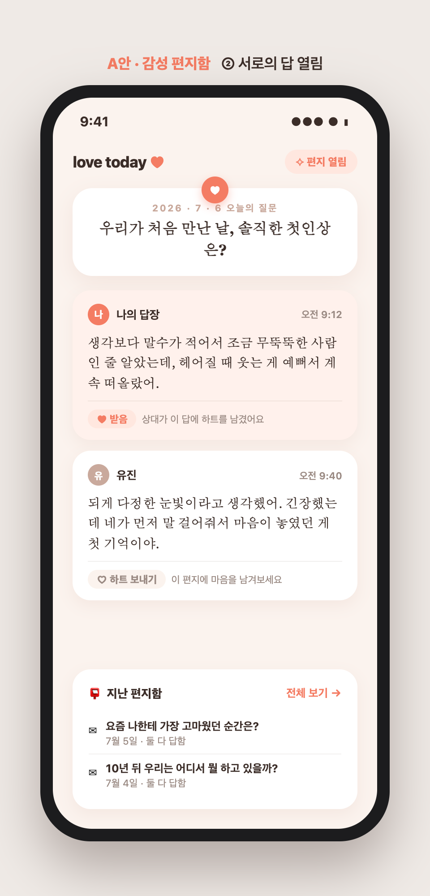
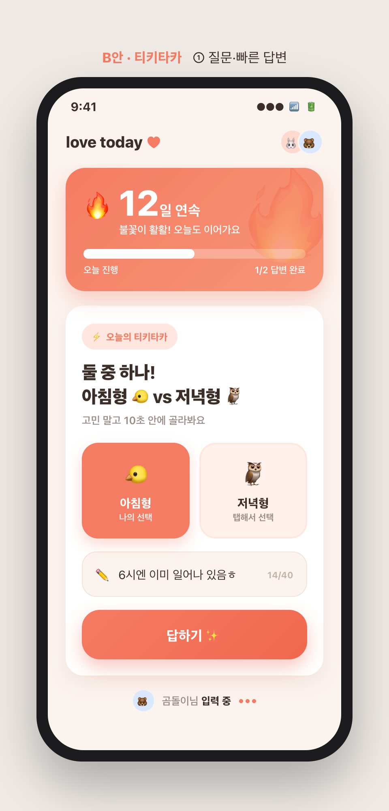
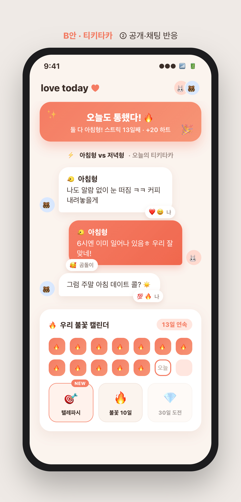
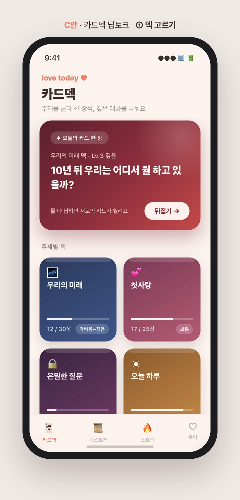
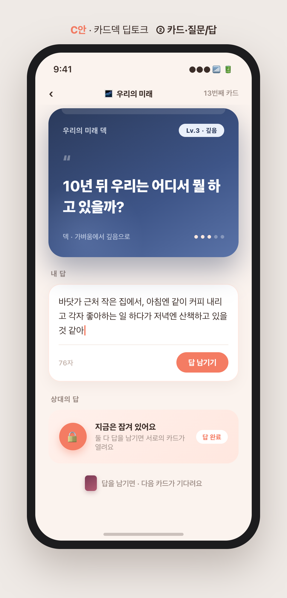

# "오늘의 질문" 방향 3안 비교 — 목업 중심

> 확정 기능: **오늘의 질문**(매일 질문 1개 → 둘 다 답하면 서로의 답이 열림 → 스트릭·히스토리).
> 같은 기능을 **어떤 느낌으로 만들지** 3가지 방향을 각 2장씩 목업으로 제시하고, 타 앱을 분석해 차별점을 정리했다.
> 목업 상단에 안/화면 번호 표기. 원본: `docs/planning/daily-question/`.

---

## 타 앱 분석 (오늘의 질문류 전반)

| 앱 | 하는 방식 | 배울 점 | 한계 |
|---|---|---|---|
| **Paired** | 하루 한 질문 → 둘 다 답해야 서로 열림, 전문가 콘텐츠 | '상호 잠금 해제' 구조 자체가 강력 | 카드형 Q&A라 기능적, 답이 흘러가 소장감 약함 |
| **Honi / 커플 Q&A** | 매일 질문·답변 아카이브 | 꾸준한 데일리 리듬 | 톤이 밋밋, 재미/깊이 중 하나에 치우침 |
| **We're Not Really Strangers** | 3단계 레벨 카드덱으로 대화 심화 | 레벨 진행으로 깊이 조절 | 대면 카드게임, 비동기·원격 불가 |
| **Gottman Card Decks** | 주제별 덱(가치관·꿈·친밀감) | 주제 브랜딩 | 게임화·수집 요소 없음 |
| **BeReal/스냅챗 스트릭** | 🔥연속 일수로 재접속 유도 | 스트릭의 습관화 힘 | 관계 맥락 없음, 혼자 유지 부담 |

투데이의 공통 무기: **교환일기의 '둘 다 써야 열림' 언락**을 이미 갖고 있음 → 어떤 느낌으로 감쌀지가 이 3안의 차이다.

---

## A안 · 감성 편지함 — 잔잔·깊이·소장

 

**한 줄 컨셉** — 질문이 편지처럼 도착하고, 두 사람의 답이 편지지로 쌓여 **두고두고 꺼내보는 소장용 기록**이 된다.

- **타 앱 대비 차별점**: Paired의 상호 잠금을 **편지 은유**로 감쌈 — 질문=밀랍 봉인(♥), 답=편지지에 적기, 완료=봉인, 상대가 답하면 개봉. 흘러가는 피드가 아니라 '지난 편지함' 아카이브로 쌓여 **경쟁 대신 keepsake 정서**로 리텐션.
- **두 화면**: ① 편지 도착 + 편지지에 답장 작성(상대는 🔒) · ② 둘 다 답해 열린 편지 두 장 나란히 + 하트 반응 + 지난 편지함.
- **맞는 커플**: 장거리·오래된 연인처럼 속마음을 천천히 곱씹으며 기록을 남기고 싶은, 정서적 깊이를 원하는 커플.

## B안 · 티키타카 — 가볍고 재미·게임형

 

**한 줄 컨셉** — 가벼운 질문에 **채팅 버블처럼 톡톡** 답하고, 🔥스트릭·배지로 "오늘도 통했다" 습관을 만드는 게임형 티키타카.

- **타 앱 대비 차별점**: BeReal 스트릭을 **둘이 함께 쌓는 공동 목표**로 전환(상대 '입력 중…'이 애정 넛지). 밸런스게임식 A/B 칩으로 진입장벽 10초, 뒤에 **한 줄 덧붙이기**를 붙여 가벼움은 유지하되 "왜 그 선택인지"가 대화로 열림.
- **두 화면**: ① 🔥12일 스트릭 히어로 + A/B 선택 칩 + 한 줄 입력 + 상대 타이핑 인디케이터 · ② "오늘도 통했다!" 배너 + 채팅 버블 주고받기(이모지 반응) + 불꽃 캘린더·배지.
- **맞는 커플**: 카톡을 하루 종일 주고받는, 짧고 자주 톡톡 튀는 소통과 "우리 잘 맞네" 확인을 즐기는 젊은/장난기 많은 커플.

## C안 · 카드덱 딥토크 — 주제별·의도적·프리미엄

 

**한 줄 컨셉** — 매일 밀려오는 질문이 아니라, **주제 덱을 골라 카드 한 장을 의도적으로 뒤집어** 가벼움→깊음으로 대화를 심화하는 프리미엄 딥토크.

- **타 앱 대비 차별점**: We're Not Really Strangers의 **레벨 진행** + Gottman의 **주제 덱**을 가져오되, 두 앱엔 없는 **비동기 언락(둘 다 답해야 상대 카드가 열림)**과 **수집·스트릭 언락 덱**을 결합. 대면 카드게임을 떨어져서도 되는 교환일기로 변환.
- **두 화면**: ① 주제별 덱 그리드(우리의 미래·첫사랑·은밀한 질문·오늘 하루, 진행도·난이도, 잠긴 덱) + '오늘의 카드 한 장' · ② 큰 리치 카드에 질문(Lv 배지) + 내 답 입력 + 상대 답 자물쇠 + 다음 카드.
- **맞는 커플**: 대화가 얕아진 걸 느끼거나, 안부보다 미래·가치관 같은 깊은 얘기를 의도적으로 꺼내고 싶은 진지한 커플.

---

## 한눈 비교 & 추천

| 축 | A안 편지함 | B안 티키타카 | C안 카드덱 |
|---|---|---|---|
| 톤 | 잔잔·감성 | 경쾌·게임 | 세련·의도적 |
| 답변 부담 | 중(한 편지) | 낮음(칩+한 줄) | 중~높(깊은 질문) |
| 리텐션 동력 | 소장·아카이브 | 스트릭·재미 | 수집·심화 |
| 개발 비용 | 낮음 | 낮~중(스트릭·반응) | 중(덱·레벨 콘텐츠) |
| 앱 정체성 적합 | ★★★ 일기 감성과 가장 결 맞음 | ★★ 활기 더함 | ★★ 차별적·프리미엄 |

**추천**: 앱이 '교환일기'라는 잔잔한 정체성을 가진 만큼 **A안(감성 편지함)을 기본 뼈대**로 하되, **B안의 스트릭·가벼운 밸런스 질문을 진입장벽 낮추는 장치로 일부 흡수**하는 조합을 권한다(감성 유지 + 매일 참여 습관). C안은 나중에 '주제 덱'을 유료/시즌 콘텐츠로 확장하는 방향으로 남겨두면 좋다.

- 1순위: **A안 기반** + B안의 스트릭/가벼운 질문 옵션
- 확장: C안 주제 덱(수익화 여지)

방향을 고르시면(또는 조합) 그 안으로 화면 흐름·데이터 구조까지 상세 설계하고 구현에 들어가겠습니다.

---

*목업 원본: `docs/planning/daily-question/{a,b,c}-{1,2}.html` + PNG. 순수 HTML 제작, 앱 톤(코럴/크림) 반영.*
