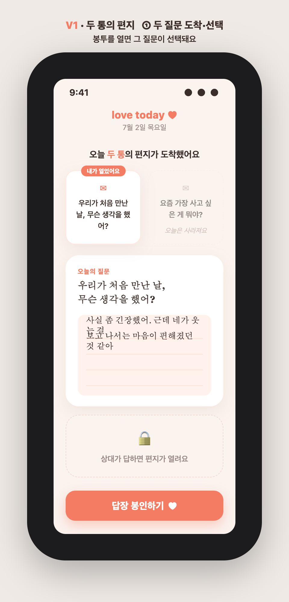
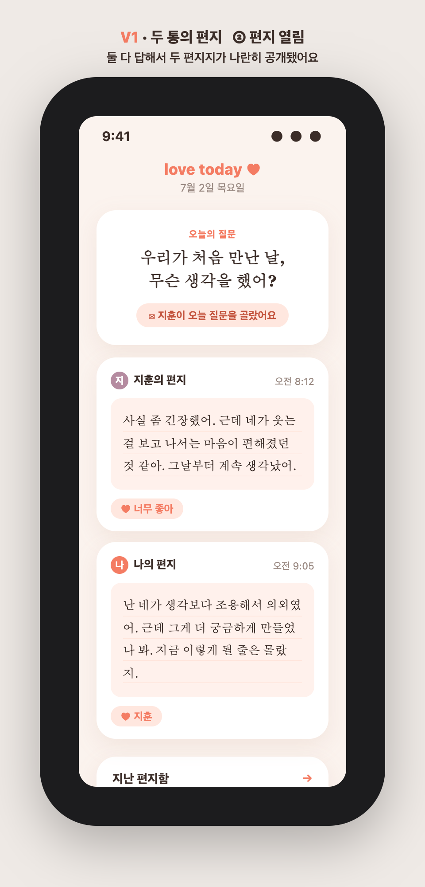
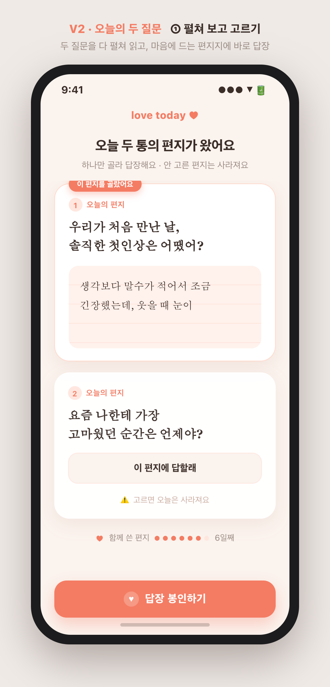
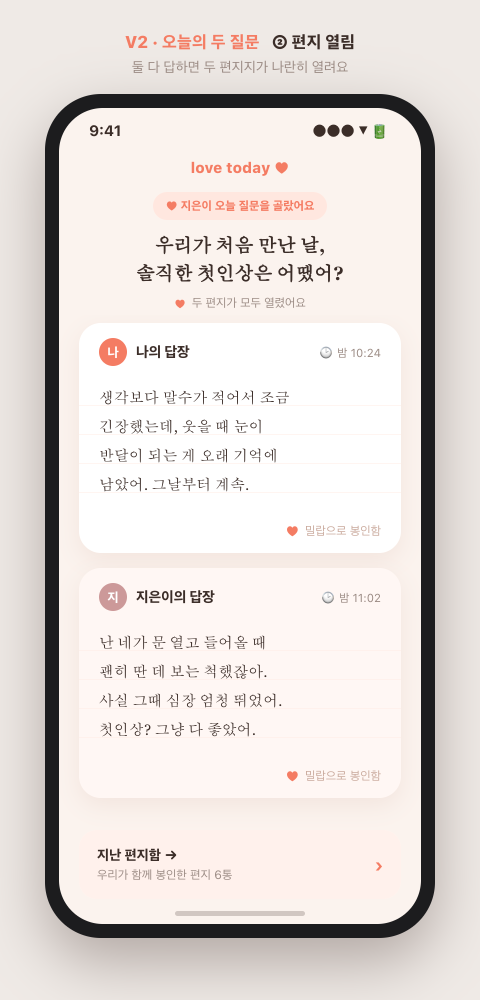
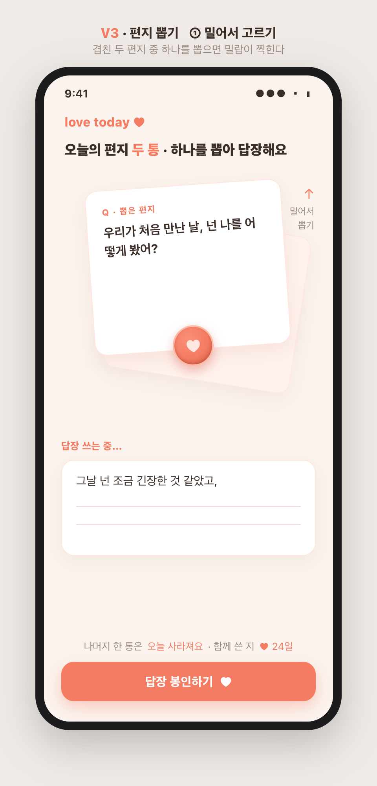
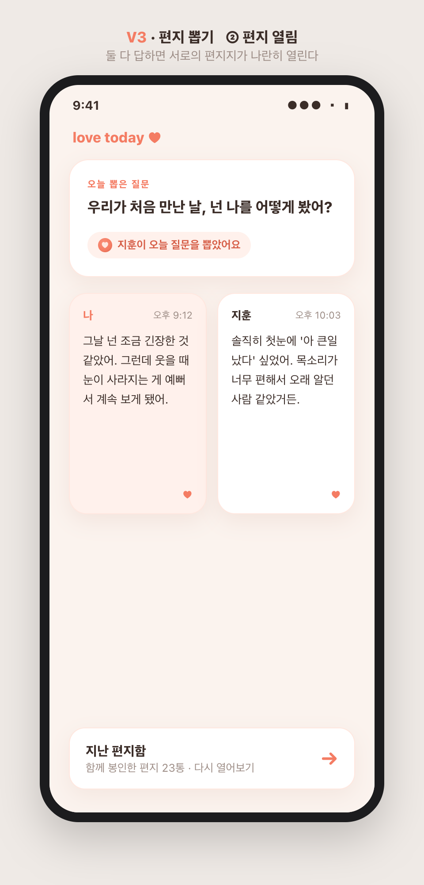

# 22 · 오늘의 질문 — A안(감성 편지함) 3버전

> 확정: **A안 감성 편지함** 방향([21 참고](21-daily-question-directions.md)).
> 새 메커니즘: **매일 질문이 2개 도착 → 먼저 본 사람이 하나를 선택(선택하며 바로 답장) → 안 고른 질문은 그날 사라짐 → 상대에겐 "○○가 오늘 질문을 골랐어요" 표시 → 둘 다 답하면 편지 열림.**
> "2개 중 고르기"를 편지 감성으로 푸는 방식이 다른 3버전을 각 2장(①선택 / ②열림)씩 목업으로 제시. 원본: `docs/planning/daily-question-A/`.

---

## 확정된 동작(3버전 공통)
- 매일 **새 질문 2개** 도착(안 고른 것은 그날 버려짐 — 다음날 또 새 2개).
- **먼저 본 사람이 선택하며 곧바로 답장**을 쓴다(선택=답장 시작).
- 상대는 나중에 들어와 **이미 골라진 하나의 질문**에 답한다.
- 열린 편지엔 **"○○가 오늘 질문을 골랐어요/뽑았어요"** 뱃지로 고른 사람 표시.
- 둘 다 답하면 두 편지지가 나란히 공개 + 하트 반응 + '지난 편지함' 아카이브.

---

## V1 · 두 통의 편지 — 봉투 열기

 

**방식** — 봉투 두 통이 나란히 도착 → 하나를 '열면' 그게 선택되고 편지지가 펼쳐져 바로 답장. 안 연 봉투는 흐려지며 "오늘은 사라져요".
- **장점**: '봉투를 연다'는 제스처가 선택과 답장을 하나의 감성 행동으로 자연스럽게 묶음. 가장 직관적.
- **단점**: 봉투 미리보기가 짧아 열기 전 두 질문을 충분히 비교하기 어려움.

## V2 · 오늘의 두 질문 — 펼쳐 보고 고르기

 

**방식** — 두 질문의 전문이 편지지 카드로 다 펼쳐져 보이고, 마음에 드는 쪽 '이 편지에 답할래'를 골라 바로 답장.
- **장점**: 두 질문을 다 읽고 고르니 **후회 없는 선택**. 정말 답하고 싶은 질문을 확실히 고른다.
- **단점**: 카드가 커져 스크롤이 생기고, 고른 순간 다른 질문이 사라지는 상실감이 조금 더 크게 느껴질 수 있음.

## V3 · 편지 뽑기 — 밀어서 고르기

 

**방식** — 겹쳐 도착한 두 편지 중 하나를 밀어 '뽑으면' 밀랍 봉인(♥)이 찍히며 답장이 시작되는, 매일의 작은 의식(ritual).
- **장점**: '뽑기' 제스처 + 봉인 연출로 **선택 자체가 감성적 이벤트**가 되어 매일 여는 재미가 큼.
- **단점**: 카드 겹침·뽑기 인터랙션이 구현/터치 정확도 면에서 까다롭고, 뒤 카드 질문이 가려 비교가 불편.

---

## 한눈 비교 & 추천

| 축 | V1 두 통의 편지 | V2 펼쳐 보고 고르기 | V3 편지 뽑기 |
|---|---|---|---|
| 선택 방식 | 봉투 열기 | 두 질문 다 읽고 버튼 | 밀어서 뽑기(제스처) |
| 질문 비교 | 어려움(미리보기 짧음) | 쉬움(전문 노출) | 어려움(뒤 카드 가림) |
| 감성/의식감 | 중 | 낮음(실용적) | 높음(봉인 연출) |
| 구현 난이도 | 낮음 | 낮음 | 중~높음(겹침·제스처) |
| 첫인상 임팩트 | 은은 | 정보적 | 강함 |

**추천: V1(두 통의 편지)을 기본**으로.
- 편지 감성과 '선택=답장 시작'을 가장 매끄럽게 묶고 구현도 가볍다.
- 다만 "열기 전 비교가 어렵다"는 V1의 약점은, **봉투에 질문 한 줄 미리보기를 조금 더 노출**(V2의 장점 일부 흡수)해 보완하면 좋다.
- V3의 밀랍 봉인 연출은 **'답장 봉인하기'를 누르는 순간의 마이크로 애니메이션**으로 일부 차용하면, 뽑기 인터랙션의 부담 없이 의식감만 가져올 수 있다.

즉 **V1 뼈대 + V2의 질문 미리보기 + V3의 봉인 연출** 조합을 1순위로 제안.

방향을 확정해 주시면 이 버전으로 화면 흐름(먼저 본 사람 / 나중 본 사람 각 시나리오)·데이터 구조까지 상세 설계하고 구현에 들어가겠습니다.

---

*목업 원본: `docs/planning/daily-question-A/v{1,2,3}-{1,2}.html` + PNG. 순수 HTML, 앱 톤(코럴/크림) 반영.*
