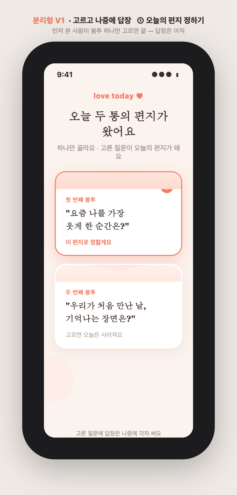
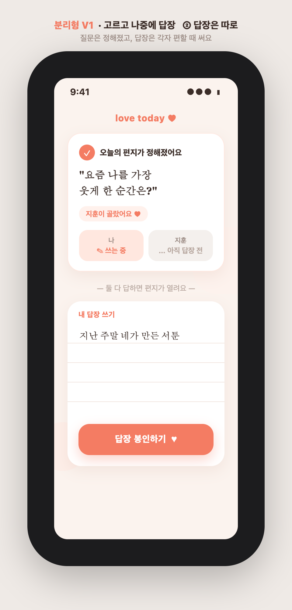
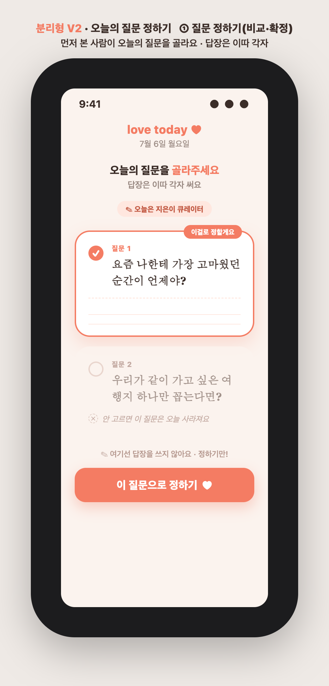
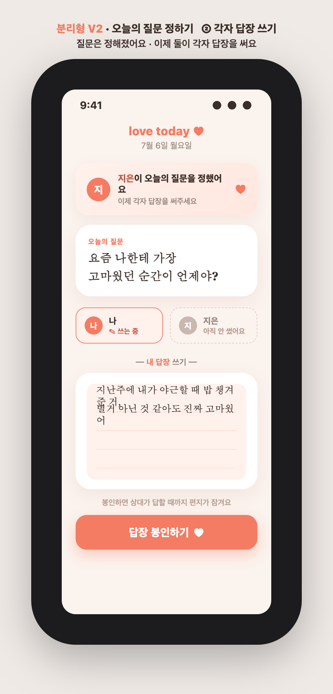
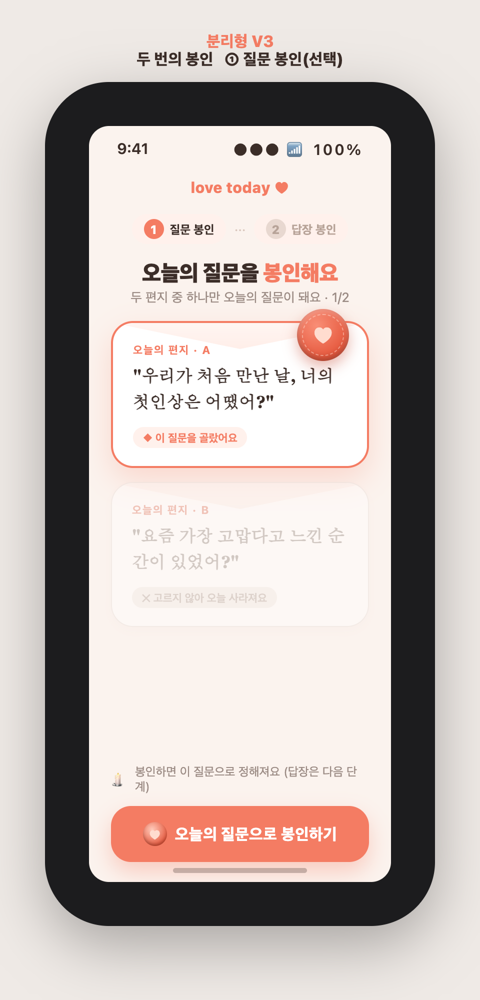
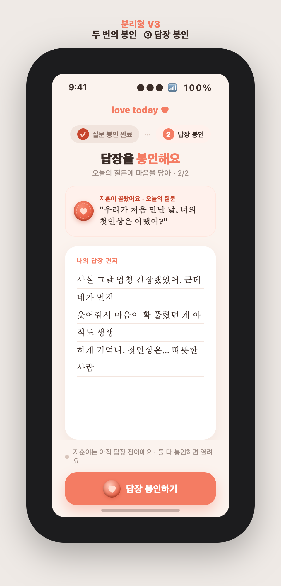

# 23 · 오늘의 질문 — A안(감성 편지함) 분리형 3버전

> [22](22-daily-question-A-versions.md)가 **"선택하며 바로 답장"**(선택=답장 시작)이었다면, 이 문서는 **"선택과 답장을 분리"**한 흐름의 3버전이다.
> 공통 메커니즘은 동일하되(매일 질문 2개 → 먼저 본 사람이 하나 선택 → 안 고른 건 그날 사라짐 → "○○가 골랐어요" 표시 → 둘 다 답하면 열림), **선택 단계와 답장 단계가 화면·시점상 나뉜다.**
> ★ 핵심 차이: **①선택 화면엔 답장 입력칸이 없다.** 답장은 별도 단계로 각자 쓴다. 원본: `docs/planning/daily-question-A-split/`.

---

## 22(비분리) vs 23(분리) 한 줄 비교
- **22 비분리**: 먼저 본 사람이 고르는 순간 그 자리에서 답장까지 씀. 흐름이 짧고 몰입 즉시. 단, 고르는 사람은 '바로 써야 하는' 부담.
- **23 분리**: 먼저 본 사람은 질문만 정함 → 답장은 두 사람 각자 편할 때. 부담이 낮고 여유롭되, 완료(열림)까지 한 걸음 더.

---

## 분리형 V1 · 고르고 나중에 답장 (시간 분리)

 

**방식** — 먼저 본 사람이 봉투 하나를 **'오늘의 편지로 정하기'** 만 하면 끝. 두 사람 모두에게 **'오늘의 편지가 정해졌어요 — 답장 쓰기'** 대기 카드가 뜨고, 각자 준비되면 답장.
- **장점**: 질문 확정과 답장이 시점상 나뉘어 부담이 낮고, 급하게 안 써도 됨.
- **단점**: 두 단계라 이탈 지점이 늘고, 열림까지 걸음이 하나 더.
- **화면**: ① 봉투 2통 중 하나 선택·확정(답장칸 없음) · ② '정해졌어요' 상태(나=쓰는 중/상대=아직) + 별도 답장 편지지.

## 분리형 V2 · 오늘의 질문 정하기 (역할 분리)

 

**방식** — 먼저 본 사람이 두 질문을 비교해 **'오늘의 질문으로 정할게'**(큐레이터 역할)로 확정 → 상대에게 **"○○가 오늘의 질문을 정했어요"** 알림 → 두 사람 각자 답장.
- **장점**: 역할이 명확해 '오늘은 내가 골라준다'는 애정 제스처가 생기고, 선택·답장 부담이 나뉨.
- **단점**: 고를 때 답장 맥락이 없어 '즉흥 감흥→바로 쓰기' 흐름은 끊김.
- **화면**: ① 두 질문 비교·택1 확정('큐레이터' 칩, 답장칸 없음) · ② "○○가 정했어요" 배너 + 상태 pill + 별도 답장 편지지.

## 분리형 V3 · 두 번의 봉인 (의식 분리)

 

**방식** — 하루에 봉인이 두 번. 고른 질문을 밀랍으로 **'봉인'해 오늘의 질문 확정(1차)**, 나중에 다른 화면에서 답장 편지지를 써서 다시 **'봉인'(2차)**.
- **장점**: 선택·답장 순간이 뚜렷이 나뉘어 각 단계가 가볍고, 봉인이 두 번이라 의식감·기대감이 배가.
- **단점**: 완료까지 앱을 두 번 열어야 해 마찰이 늘고, 질문만 고르고 답장을 미루면 미완성이 길어질 수 있음.
- **화면**: ① 두 편지 중 하나에 밀랍 봉인(1/2, 답장칸 없음, 상단 1·2 단계 표시) · ② 답장 편지지 작성 후 2차 봉인(1단계 ✓·2단계 활성).

---

## 한눈 비교 & 추천

| 축 | V1 고르고 나중에 | V2 질문 정하기 | V3 두 번의 봉인 |
|---|---|---|---|
| 분리 강조점 | 시간(대기 카드) | 역할(큐레이터+알림) | 의식(2회 봉인) |
| 부담 | 낮음 | 낮음 | 낮음(단계는 뚜렷) |
| 감성/특별함 | 은은 | 다정한 제스처 | 가장 큼 |
| 마찰(완료까지) | 보통 | 보통 | 큼(두 번 열기) |
| 구현 난이도 | 낮음 | 낮~중 | 중 |

**추천: 분리형 V1(고르고 나중에 답장)을 기본**으로.
- 가장 자연스럽고 구현이 가벼우며, '오늘의 편지가 정해졌어요' 대기 카드가 홈에 남아 **두 사람 다 답장하러 돌아올 훅**이 된다.
- 여기에 **V2의 "○○가 정했어요" 알림·큐레이터 뉘앙스**를 얹으면 다정함이 더해지고, **V3의 밀랍 봉인 연출**은 '답장 봉인하기' 순간의 마이크로 애니메이션으로 일부만 차용하면 좋다.

즉 **V1 뼈대 + V2의 알림 + V3의 봉인 연출**을 1순위로 제안(22의 결론과 동일한 조합 철학).

> **22 vs 23 최종 선택 포인트** — 매일 짧게 몰입시키고 싶으면 **22(비분리)**, 부담을 낮추고 '정해두고 각자 여유롭게'가 맞으면 **23(분리)**. 앱의 잔잔한 정체성과 "답장을 곱씹어 쓰는" 편지 감성엔 **23-V1**이 가장 결이 맞는다.

방향을 확정해 주시면 그 버전으로 먼저 본 사람/나중 본 사람 시나리오·데이터 구조까지 상세 설계하고 구현에 들어가겠습니다.

---

*목업 원본: `docs/planning/daily-question-A-split/v{1,2,3}-{1,2}.html` + PNG. 순수 HTML, 앱 톤(코럴/크림) 반영.*
