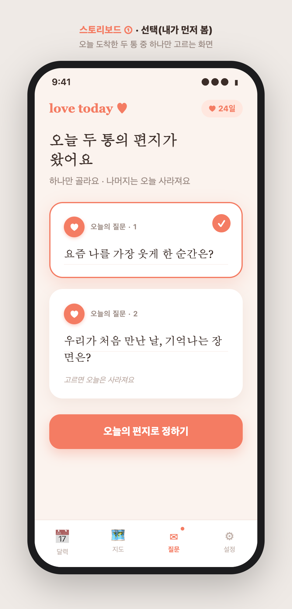
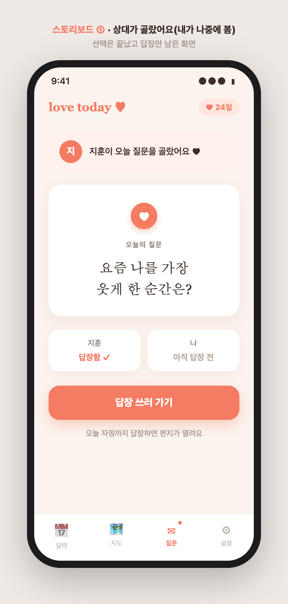
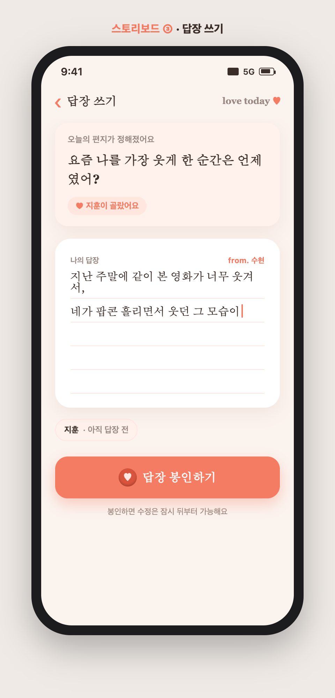
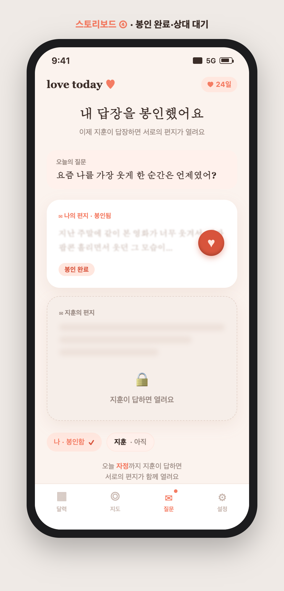
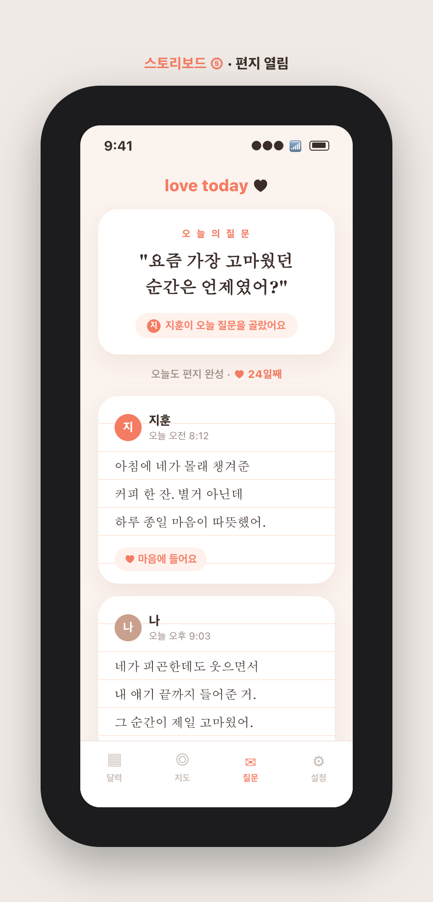
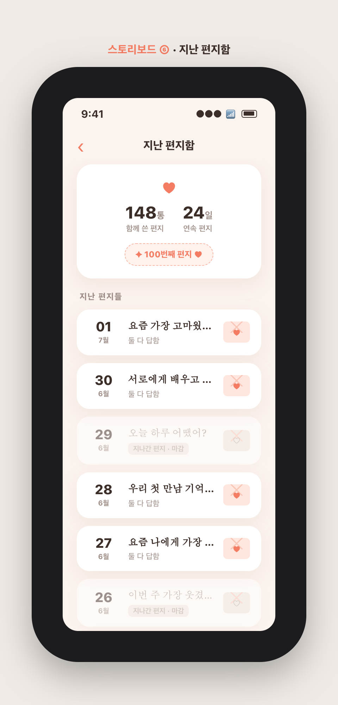
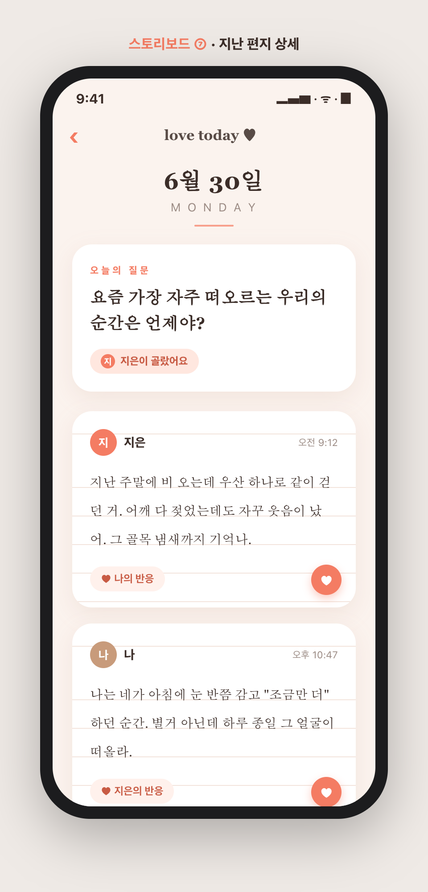
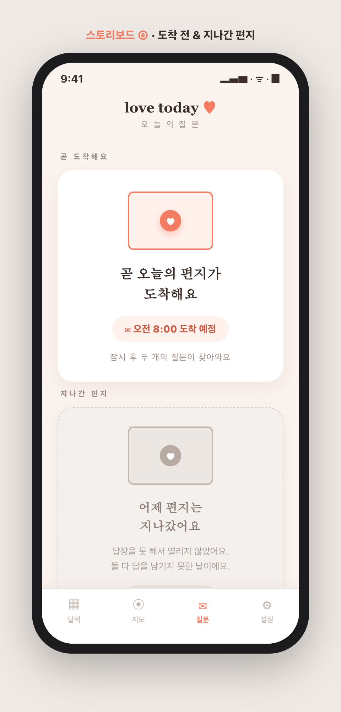
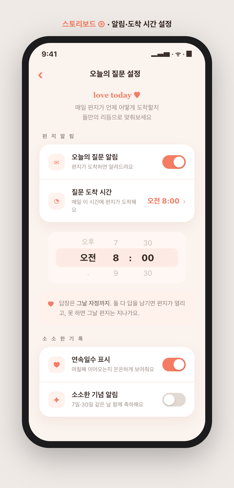

# 24 · 오늘의 질문 — 확정안(분리형 V1) 전체 스토리보드 & 기능 명세

> 확정: **A안 감성 편지함 · 분리형 V1(고르고 나중에 답장)**. ([21](21-daily-question-directions.md)→[22](22-daily-question-A-versions.md)→[23](23-daily-question-A-split-versions.md) 경유)
> 결정 사항: **탭바 4번째 일반 탭 / 마감=다음날 도착시간까지 / 질문 도착 시간 설정 가능 / 은은한 스트릭+소소한 기념.**
> 질문 데이터 리스트는 **추후 AI가 생성**(본 문서 §7에 연동 지점 명시). 목업 원본: `docs/planning/daily-question-storyboard/`.

---

## 1. 개요
매일 **질문 2개**가 커플에게 도착한다. **먼저 본 사람이 하나를 고르면(질문만 확정)** 그 질문이 '오늘의 편지'가 되고, **안 고른 질문은 그날 사라진다.** 답장은 선택과 분리된 별도 단계로 **두 사람이 각자** 쓴다. 질문 받은 **다음날 같은 도착시간까지 둘 다 답장(봉인)** 하면 서로의 편지가 열리고, 못 하면 그 편지는 지나가며 연속(스트릭)이 끊긴다. 답변은 '지난 편지함'에 소장된다.

핵심 정서: 경쟁이 아니라 **두고두고 꺼내보는 편지 아카이브**. 게임 요소(스트릭·기념)는 은은하게만.

---

## 2. 탭바 변경
기존 **달력 · 지도 · 설정(3탭)** → **달력 · 지도 · 질문 · 설정(4탭)**.
- '질문' 탭 아이콘 = 편지(✉). 활성 시 코럴.
- **할 일 뱃지**: 오늘 내가 할 액션(선택 or 답장)이 남아 있으면 아이콘에 작은 코럴 점.

---

## 3. 하루 흐름 (상태 다이어그램)

```
[도착 전] ──설정 시간──▶ [질문 2개 도착]
                              │
                 ┌────────────┴─────────────┐
        (내가 먼저 봄)                 (상대가 먼저 봄)
        ①선택 화면                    ②상대가 골라둠
        하나 고름                     → 바로 답장 대기
                 └────────────┬─────────────┘
                       [오늘의 질문 확정]
                              │  (각자 별도로)
                        ③답장 쓰기 → 봉인
                              │
                   ┌──────────┴──────────┐
            나만 봉인             둘 다 봉인
            ④상대 대기            ⑤편지 열림
                   │                     │
        (다음 도착시간까지 미완)  지난 편지함에 소장
        ⑧지나간 편지(스트릭 끊김)   ⑥ / ⑦
```

---

## 4. 스토리보드 (9프레임)

| ① 선택(내가 먼저) | ② 상대가 골랐어요 | ③ 답장 쓰기 |
|---|---|---|
|  |  |  |

| ④ 봉인 완료·상대 대기 | ⑤ 편지 열림 | ⑥ 지난 편지함 |
|---|---|---|
|  |  |  |

| ⑦ 지난 편지 상세 | ⑧ 도착 전 & 지나간 편지 | ⑨ 알림·도착 시간 설정 |
|---|---|---|
|  |  |  |

---

## 5. 기능 전체 명세

### 5.1 질문 도착
- 매일 **질문 2개** 배정. 도착 시각은 **커플이 설정**(기본 오전 8:00), 설정 시각에 푸시 알림.
- 도착 전 상태: "곧 오늘의 편지가 도착해요 · 오전 8:00"(프레임 ⑧ 상단).
- 같은 커플 두 사람에게 **동일한 2개** 배정. (질문 풀은 §7 참조)

### 5.2 선택 (먼저 본 사람)
- 먼저 연 사람이 두 봉투 중 **하나 선택 → '오늘의 편지로 정하기'** (이 화면엔 **답장칸 없음**).
- 확정 즉시 **안 고른 질문은 그날 소멸**(다음날 새 2개).
- 상대에겐 **"○○가 오늘 질문을 골랐어요"** 로 고른 사람 표시.
- 상대가 이미 골랐으면 나는 **선택 화면을 건너뛰고** 확정된 질문에 바로 답장(프레임 ②).

### 5.3 답장 (분리·각자)
- 선택과 분리된 별도 화면에서 **각자** 답장 작성 → **'답장 봉인하기'**.
- 봉인 후 **내 답장은 잠금**, 상대 답장도 잠금(블러) — "○○이 답하면 열려요"(프레임 ④).
- 수정: 봉인 직후 잠깐 뒤부터 가능(기존 일기 수정 규칙 재사용 검토).

### 5.4 열림 & 반응
- **둘 다 봉인**하면 두 편지지가 나란히 공개(프레임 ⑤).
- 각 편지에 **하트/한마디 반응**(기존 댓글 인프라 일부 재사용 가능).

### 5.5 마감 규칙
- **마감 = 질문 받은 다음날 도착시간(설정값).** 예: 21:00 설정 시 받은 날 21:00~다음날 21:00. 둘 다 답장 못 하면 열리지 않고 '지나간 편지'로 남음. 마감시각은 배정 시 확정 저장되어, 이후 도착시간을 바꿔도 진행 중 편지엔 영향 없음.
- 마감된 날은 **스트릭 끊김.**

### 5.6 지난 편지함 (아카이브)
- 날짜별 리스트: 질문 한 줄 + '둘 다 답함' 표시 + 편지 아이콘. 마감된 날은 흐리게(프레임 ⑥).
- 상단 요약: 함께 쓴 편지 수 · 연속일수 · 소소한 기념 배지.
- 항목 탭 → **지난 편지 상세**(프레임 ⑦): 그날 질문 + 두 답 + 반응.

### 5.7 게임 요소(은은하게)
- **연속일수(스트릭)**: 둘 다 답한 날이 이어지면 ♥N일. 헤더에 작게.
- **소소한 기념**: '100번째 편지', 특정 연속일 등 은은한 배지/알림(설정에서 on/off).

### 5.8 알림·설정 (프레임 ⑨)
- 오늘의 질문 알림 on/off · **질문 도착 시간** 설정 · 마감(다음날 도착시간) 안내 · 연속일수 표시 on/off · 소소한 기념 알림 on/off.

### 5.9 엣지케이스
- **커플 미연결**: 질문 탭은 "짝과 연결하면 오늘의 질문을 받을 수 있어요" 안내(연결 유도).
- **한 명만 답하고 마감(다음 도착시간) 경과**: 답한 사람 답변은 편지함에 '혼자 남긴 편지'로 보존 검토(또는 미열람 처리) — 정책 확정 필요.
- **도착 시간 변경**: 이미 도착한 당일엔 다음날부터 적용.
- **시간대**: 커플 공통 기준 시간대(Asia/Seoul) 사용, 기존 D-day 계산과 일관.

---

## 6. 데이터 모델 초안

```
question_pool            -- 질문 원천(§7: 추후 AI 생성)
  id, text, category, depth(1~3), tags[], active, source('ai'|'seed'), created_at

daily_question           -- 커플별 그날 배정(2개)
  id, couple_id, date, question_id, slot(1|2)
  chosen(boolean), chosen_by(user_id, null=미선택)

question_answer          -- 답장(각자)
  id, daily_question_id, author_id, text, sealed_at(null=작성중)
  -- 둘 다 sealed_at != null → 열림

answer_reaction          -- 하트/반응
  id, question_answer_id, user_id, type, created_at

question_streak          -- 커플별 스트릭/기념
  couple_id, current_streak, best_streak, total_opened, last_opened_date

question_setting          -- 커플별 설정
  couple_id, notify_on, arrival_time, show_streak, milestone_on
```

- '선택'은 `daily_question.chosen/chosen_by`로, 안 고른 slot은 그날 사용 안 함(soft-expire).
- '열림' 판정 = 해당 `daily_question`의 답 2개가 모두 `sealed_at` 설정 & 같은 날.

---

## 7. ★ AI 질문 생성 연동 지점 (추후)
- **`question_pool`이 AI가 채우는 대상.** 지금은 시드 질문 소량으로 시작하고, 이후 AI가 카테고리·깊이(가벼움~깊음)·태그를 갖춘 질문 리스트를 대량 생성해 `source='ai'`로 적재.
- 필요 인터페이스(미리 열어둘 자리):
  - 생성 배치: `POST /admin/questions/generate` (프롬프트→질문 N개, 중복/부적절 필터).
  - **매일 2개 배정 로직**: 커플의 과거 사용 이력·깊이 진행도를 고려해 pool에서 2개 pick(현재는 랜덤/미사용 우선, 후에 AI 개인화 가능).
  - 품질 가드: 커플이 '이 질문 별로예요' 신고 → `active=false` 피드백 루프.
- 즉 **화면·스키마는 지금 확정**, 질문 '내용 공급'만 AI로 갈아끼우면 되도록 분리.

---

## 8. 백엔드 API 초안
- `GET  /api/questions/today` — 오늘 배정 2개 + 상태(선택/답장/열림).
- `POST /api/questions/today/choose` `{questionId}` — 선택 확정(먼저 본 사람).
- `POST /api/questions/today/answer` `{text}` — 답장 저장(작성중).
- `POST /api/questions/today/seal` — 답장 봉인.
- `POST /api/questions/answers/{id}/react` `{type}` — 반응.
- `GET  /api/questions/archive?cursor=` — 지난 편지함.
- `GET  /api/questions/archive/{date}` — 지난 편지 상세.
- `GET/PUT /api/questions/settings` — 알림·도착시간 등.

---

## 9. 추천 착수 순서
1. 스키마 + `GET today`/`choose`/`answer`/`seal` (핵심 하루 흐름) + 시드 질문 20~30개.
2. 질문 탭 UI(①~⑤) + 지난 편지함(⑥⑦).
3. 알림(도착 시간·푸시)·마감(다음 도착시간, 배정 시 deadline 확정)·스트릭.
4. 설정(⑨)·소소한 기념.
5. **(후속) AI 질문 생성 파이프라인**으로 `question_pool` 확장.

방향 확정되었으니, 원하시면 이 명세로 **백엔드 스키마/엔드포인트부터 구현**을 시작하겠습니다.

---

*목업 원본: `docs/planning/daily-question-storyboard/01~09.html` + PNG. 순수 HTML, 앱 톤(코럴/크림)·편지 감성 반영. 탭바 4개(달력·지도·질문·설정) 일관 적용.*
