# 투데이 (Two-day) · 기획 — 홈 화면 방향 목업 비교

> **기획 문서 색인**
> - 📸 [구현 결과 & 실제 캡처 (docs/implemented)](../implemented/README.md) — 실제 동작 앱 6화면 캡처 (**1차 구현 완료**)
> - 📄 [04 · 개발 계획 & API 계약](04-dev-plan.md) — 스택·데이터모델·REST 계약
> - 📄 [10 · 지도 기능 3버전 목업](10-map.md) — Kakao Map, 핀맵/지역컬렉션/추억여정
> - 📄 [15 · 장소 추가 방식 3안](15-place-add.md) — 지도콕 / 원탭추천 / 리치검색멀티 (추천: B+C 하이브리드)
> - 📄 [15a · A안(지도에서 콕) 상세 스토리보드](15a-place-add-mappick.md) — 11프레임 + 엣지케이스, 필요 API/스키마
> - 📄 [16 · 지도 장소 선택 갭 분석 & 기획](16-map-features.md) — POI 직접 탭·검색 줌 보정·현재위치 재중심·위치가중 검색 우선순위
> - 💡 [17 · 신규 기능 제안 1탄](17-feature-proposals-1.md) — 오늘의질문·궁합퀴즈·버킷리스트·추억다시보기·홈위젯
> - 💡 [18 · 신규 기능 제안 2탄](18-feature-proposals-2.md) — 감정리포트·음성일기·데이트가계부·월말결산·데이트플래너
> - 💡 [19 · 신규 기능 제안 3탄](19-feature-proposals-3.md) — AI코치·생리주기·플레이리스트·화해모드·꾸미기
> - 💡 [20 · 신규 기능 제안 4탄](20-feature-proposals-4.md) — 데이트스와이프·우리소개·사랑의언어·지금우리·롱디모드
> - ✉️ [21 · 오늘의 질문 방향 3안](21-daily-question-directions.md) — A 감성편지함 / B 티키타카 / C 카드덱 (추천: A)
> - ✉️ [22 · 오늘의 질문 A안 3버전(선택=바로 답장)](22-daily-question-A-versions.md) — 질문 2개 도착·먼저 본 사람이 선택 (두통의편지/펼쳐보기/편지뽑기)
> - ✉️ [23 · 오늘의 질문 A안 분리형 3버전(선택↔답장 분리)](23-daily-question-A-split-versions.md) — 고르고나중에답장 / 질문정하기 / 두번의봉인 (추천: V1)
> - ⭐ [24 · 오늘의 질문 확정안(분리형 V1) 전체 스토리보드 & 기능 명세](24-daily-question-v1-spec.md) — 9프레임 스토리보드·탭바4개·데이터모델·AI질문생성 연동지점·API
> - 🤖 [25 · 오늘의 질문 AI 질문 세트 설계](25-daily-question-ai-plan.md) — 톤1:3:1·테마분류·리듬배합·가벼운맥락·배치보강 파이프라인(5단계 결정)
> - 🎨 [26 · 오늘의 질문 참고 세트 스타일 분석 & 생성 가이드](26-daily-question-style-analysis.md) — 장면셋업·빈칸·미션 문형 4패턴·톤배합·LLM 생성 프롬프트(사용자 300문항 참고)
> - 📄 [03 · A to Z 전체 화면 스토리보드](03-full-storyboard.md) — 확정 스타일(워밍 코럴&크림)로 카카오 로그인→설정 19화면
> - 📄 [02 · 톤온톤 + 사진 캘린더](02-tone-photo-calendar.md) — 썸원 참고, 이모지→사진 캘린더, 톤온톤 3색 (구조 채택, 색은 01-B로)
> - 📄 [01 · 커플앱 느낌 색 리워크](01-couple-colors.md) — 듀오톤 코럴×블루 / 워밍 코럴&크림 (반려: 듀오톤 번잡)
> - 🎨 [1-A 스티커 달력 리스타일 4색](1a-restyle/README.md) — (구) 뉴트럴/미니멀 팔레트 탐색
> - 🧩 [기능 정리 (features/)](features/README.md) — 프로필 사진 변경 · 일기 댓글
> - ⬇️ 아래: 홈 화면 방향(1안~3안) 최초 비교

> 커플 교환일기 앱. **D안(추억 타임캡슐)** 을 베이스로 두고, 홈 화면을 무엇으로 하느냐에 따라
> **달력 중심(1안)** 과 **타임라인 중심(3안)** 을 각각 2버전씩 목업으로 만들어 비교한다.

## 공통 뼈대 (4개 버전 모두 포함)
- 📝 **상호 공개** — 둘 다 그날 일기를 써야 상대 글이 열림 (안 쓰면 블러/잠금)
- 🖼️ 사진 첨부 · 📍 데이트 위치 저장
- ⏱️ 수정은 작성 몇 시간 뒤부터 (목업엔 "3시간 뒤 수정 가능")
- 🧩 템플릿(빈칸 채우기)으로 쉽게 작성 · ⭐ 데이트 점수 · 😊 오늘의 기분
- 📅 달력에서 지난 일기 열람 · ⏳ "n년 전 오늘"·기념일 회고
- 🎀 아기자기한 일기장 감성 / 게임 요소 없음

각 버전은 **① 홈 · ② 일기 작성(상대 미작성 잠금 상태) · ③ 상호 공개/회고** 3화면으로 구성.

---

## 한눈 비교

| | 계열 | 홈 주인공 | 감성 | 이런 커플에게 |
|---|---|---|---|---|
| **1-A 스티커 달력** | 달력 | 월간 달력 + 스탬프 스티커 | 밝은 파스텔·다꾸 | 매일 가볍게 채우고 수집하는 재미 |
| **1-B 종이 다이어리** | 달력 | 주간 스트립 + 종이 펼침면 | 아날로그·손글씨 | 진짜 일기장 감성을 원하는 커플 |
| **3-A 폴라로이드 피드** | 타임라인 | 세로 폴라로이드 피드 | 인스타·사진 팝 | 사진 많이 찍는 커플 |
| **3-B 타임라인 타임캡슐** | 타임라인 | 세로 연표 + 회고 강조 | 잔잔·감성 세리프 | 추억·기념일 되새김을 중시하는 커플 |

> 🖼️ 각 버전 섹션에 **목업 이미지가 바로 보이고**, 그 아래 🔗 링크로 실제 화면(HTML)도 열 수 있음(폰에서 바로 열림).
> 로컬에선 `mockups/<버전>/01-*.html` 파일을 브라우저로 열면 됨.

---

## 1안 계열 · 달력 중심

### 1-A · 스티커 달력
밝은 파스텔, 다이어리 꾸미기(다꾸) 감성. 달력 칸을 스탬프 스티커로 채우는 수집 재미.
- **01 홈** — 월간 달력, 날짜마다 기분 이모지+별점+스탬프(🌷🍰🎡), 오늘 강조, 미래는 빈 점. 상단 "1년 전 오늘" 배너, "이번 달 스티커 11/18" 진행바
- **02 작성** — 기분 6종 선택, 별점, 빈칸 템플릿 3문항, 사진, 위치(성수동·대림창고), "저장하면 잠금 대기 🔐"
- **03 상세** — "1년 전 오늘" 회고 + 내 글/상대 글 말풍선 교차 + 획득 스탬프 + 하트 반응

<table>
<tr>
<td>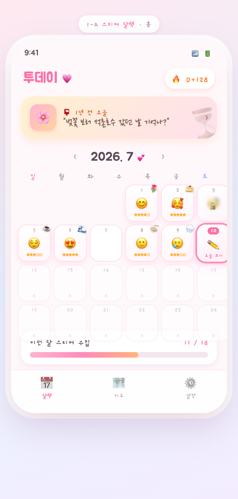 ① 홈 · 스티커 달력</td>
<td>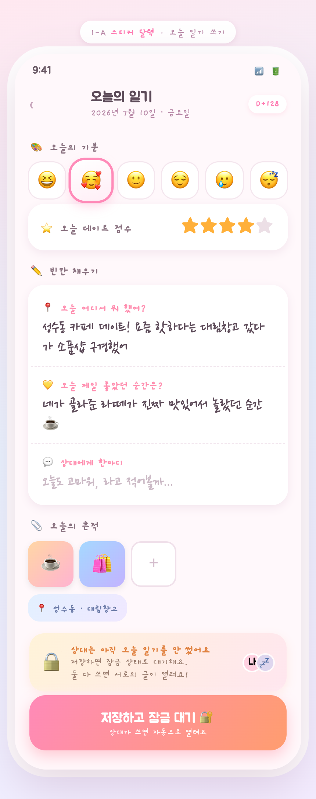 ② 일기 작성</td>
<td>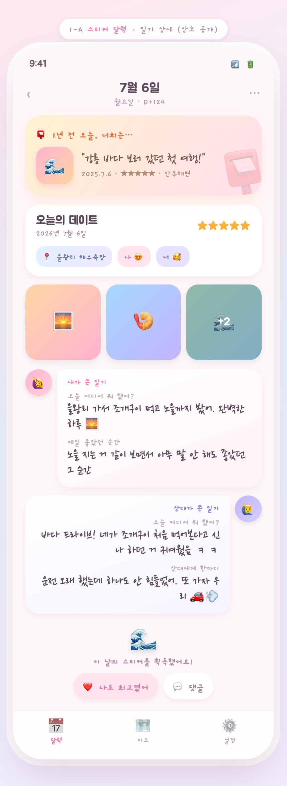 ③ 상호 공개 상세</td>
</tr>
</table>

🔗 실제 화면으로 열어보기: [홈](https://htmlpreview.github.io/?https://github.com/seunghw2/couple-diary/blob/main/docs/planning/mockups/1a-sticker-calendar/01-home-calendar.html) · [작성](https://htmlpreview.github.io/?https://github.com/seunghw2/couple-diary/blob/main/docs/planning/mockups/1a-sticker-calendar/02-write.html) · [상세](https://htmlpreview.github.io/?https://github.com/seunghw2/couple-diary/blob/main/docs/planning/mockups/1a-sticker-calendar/03-detail.html)

### 1-B · 종이 다이어리 달력
크림색 종이·마스킹테이프·재봉선·손글씨. "진짜 일기장"에 가장 가까움.
- **01 홈** — 가로 주간 스트립 + 종이 펼침면(둘의 글 위아래 나란히, 테이프로 붙인 사진), 하단 별점·기분·위치
- **02 작성** — 줄노트+빨간 마진선 위 빈칸 채우기, 별점·기분, 테이프 사진, "상대 미작성 잠금 대기", "3시간 뒤 수정"
- **03 월간+회고** — 스티치 테두리 월간 달력(둘 다 씀/한 명만/기념일 구분) + 종이 쪽지처럼 얹힌 "2년 전 오늘" 회고

<table>
<tr>
<td>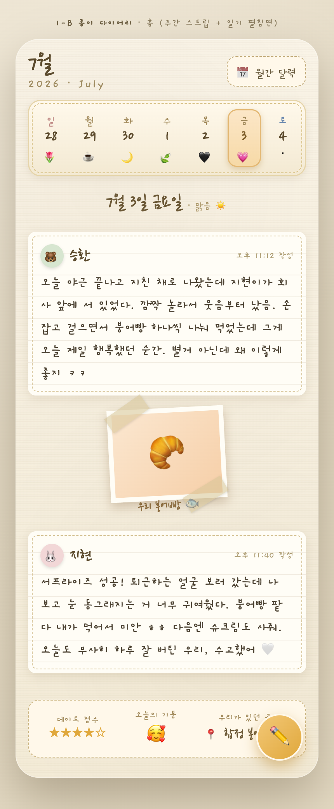 ① 홈 · 종이 다이어리</td>
<td>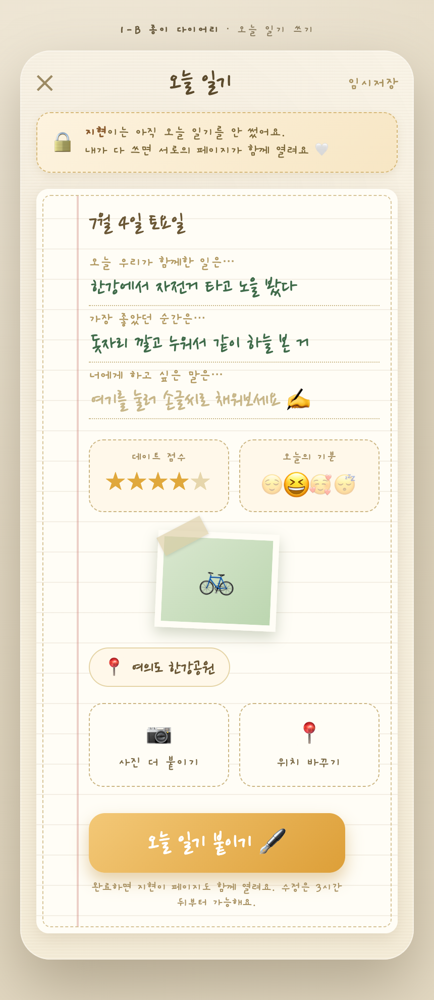 ② 일기 작성</td>
<td>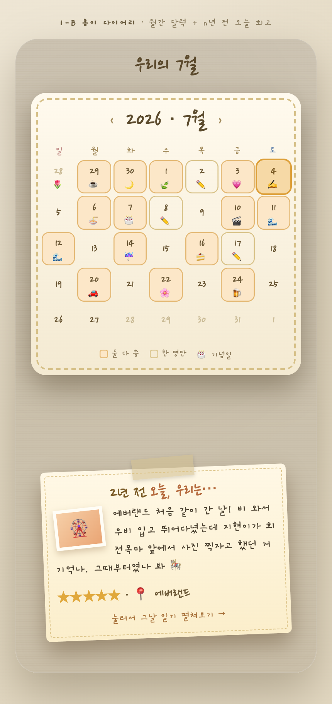 ③ 월간 달력·회고</td>
</tr>
</table>

🔗 실제 화면으로 열어보기: [홈](https://htmlpreview.github.io/?https://github.com/seunghw2/couple-diary/blob/main/docs/planning/mockups/1b-paper-diary/01-home-diary.html) · [작성](https://htmlpreview.github.io/?https://github.com/seunghw2/couple-diary/blob/main/docs/planning/mockups/1b-paper-diary/02-write.html) · [월간·회고](https://htmlpreview.github.io/?https://github.com/seunghw2/couple-diary/blob/main/docs/planning/mockups/1b-paper-diary/03-month-recall.html)

---

## 3안 계열 · 타임라인 중심

### 3-A · 폴라로이드 피드
살짝 기울어진 폴라로이드 카드가 세로로 흐르는, 둘만의 인스타/앨범.
- **01 홈** — 상단 "1년 전 오늘"+500일 D-day 고정, 아래로 기울어진 폴라로이드 피드(사진·한줄·별점·기분·위치 배지), 미작성은 블러+자물쇠
- **02 작성** — 폴라로이드 사진 업로더 먼저 → 빈칸 템플릿 → 별점·기분·위치, 하단 "둘 다 써야 열림" 블러 대기
- **03 상세** — "2년 전 오늘" 리본, 테이프 붙은 큰 폴라로이드, 좌우 교차 말풍선, 위치 핀 지도(방문 횟수), 리액션 바

<table>
<tr>
<td>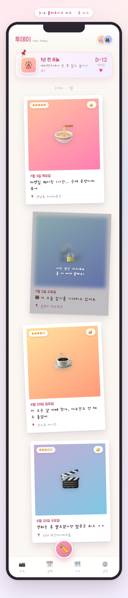 ① 홈 · 폴라로이드 피드</td>
<td>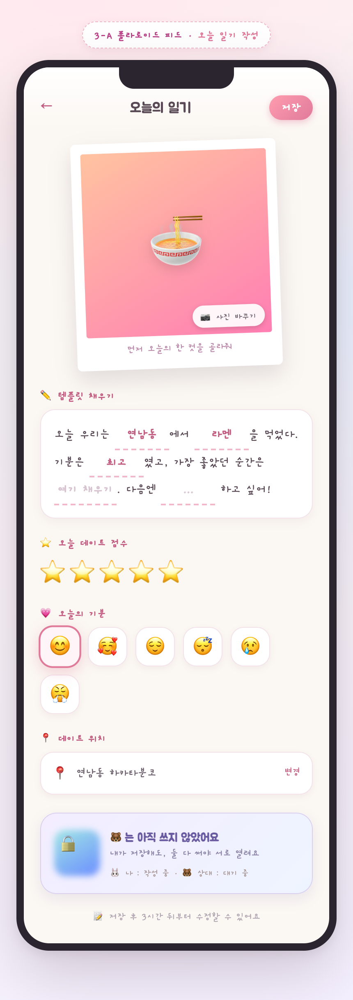 ② 일기 작성</td>
<td>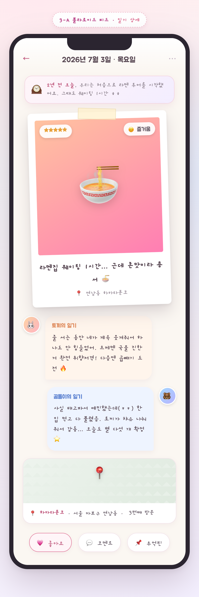 ③ 상호 공개 상세</td>
</tr>
</table>

🔗 실제 화면으로 열어보기: [홈](https://htmlpreview.github.io/?https://github.com/seunghw2/couple-diary/blob/main/docs/planning/mockups/3a-polaroid-feed/01-home-feed.html) · [작성](https://htmlpreview.github.io/?https://github.com/seunghw2/couple-diary/blob/main/docs/planning/mockups/3a-polaroid-feed/02-write.html) · [상세](https://htmlpreview.github.io/?https://github.com/seunghw2/couple-diary/blob/main/docs/planning/mockups/3a-polaroid-feed/03-detail.html)

### 3-B · 타임라인 타임캡슐
화면을 관통하는 세로 연표. 시간의 흐름과 기념일 회고가 주인공. 가장 감성적.
- **01 홈** — 중앙선 타임라인 + 좌우 지그재그 노드(날짜·썸네일·별점·한줄), 연/월 구분. 상단 "1주년 D-7"·"1년 전 오늘" 강조, 미작성 잠금
- **02 작성** — "오늘 우리는 ___에서 ___을 봤다" 손글씨 빈칸 템플릿, 기분·별점·사진·위치, "잠금 대기"+"3시간 뒤 수정"
- **03 타임캡슐** — "1년 전 오늘" 밤하늘톤 캡슐이 열려 그날 두 사람 일기가 편지처럼 등장 + 기념일 여정(100·300·1주년) + 연말 결산

<table>
<tr>
<td>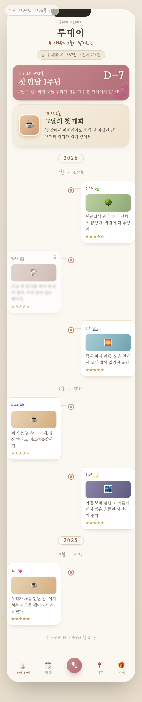 ① 홈 · 타임라인</td>
<td>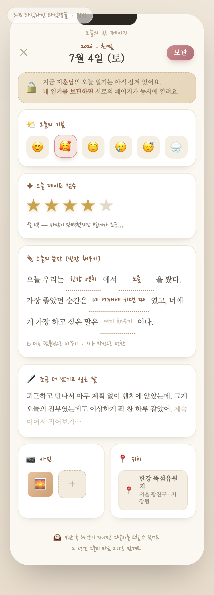 ② 일기 작성</td>
<td>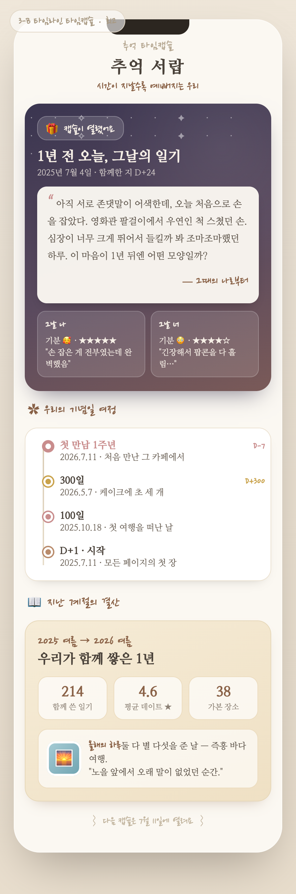 ③ 타임캡슐·회고</td>
</tr>
</table>

🔗 실제 화면으로 열어보기: [홈](https://htmlpreview.github.io/?https://github.com/seunghw2/couple-diary/blob/main/docs/planning/mockups/3b-timeline-capsule/01-home-timeline.html) · [작성](https://htmlpreview.github.io/?https://github.com/seunghw2/couple-diary/blob/main/docs/planning/mockups/3b-timeline-capsule/02-write.html) · [타임캡슐](https://htmlpreview.github.io/?https://github.com/seunghw2/couple-diary/blob/main/docs/planning/mockups/3b-timeline-capsule/03-capsule-recall.html)

---

## 리드 추천

**결론: "1-B 종이 다이어리(홈) + 3-B 타임캡슐(회고 탭)" 조합.**

1안 vs 3안은 둘 중 하나를 버리는 대신 **역할을 나누면** 가장 잘 맞는다.

- **홈은 1-B 종이 다이어리.** 네가 콕 집은 "달력에서 지난 일기 열람"이 그대로 홈이 되고, 네 가지 중 "진짜 일기장" 감성이 제일 강하다. 매일 종이 한 장을 채우는 정서적 만족이 커플 교환일기의 핵심 행동을 잘 유도한다. (스티커 팝이 더 취향이면 1-A로 교체 가능 — 구조는 동일)
- **회고는 3-B 타임캡슐 탭.** D안(추억 타임캡슐) 베이스의 감성 보상이 여기서 폭발한다. "1년 전 오늘"·기념일·연말 결산은 일상 홈과 분리된 별도 탭일 때 더 특별하게 느껴진다.
- **위치**는 두 화면 공통으로 핀 저장 + 별도 "지도 모아보기"는 후순위 탭.

즉 **탭 구성: 달력(1-B) · 회고(3-B) · 지도 · 설정.** 한쪽만 골라야 한다면 → 일상성 우선이면 **1-B**, 감성 임팩트 우선이면 **3-B**.
